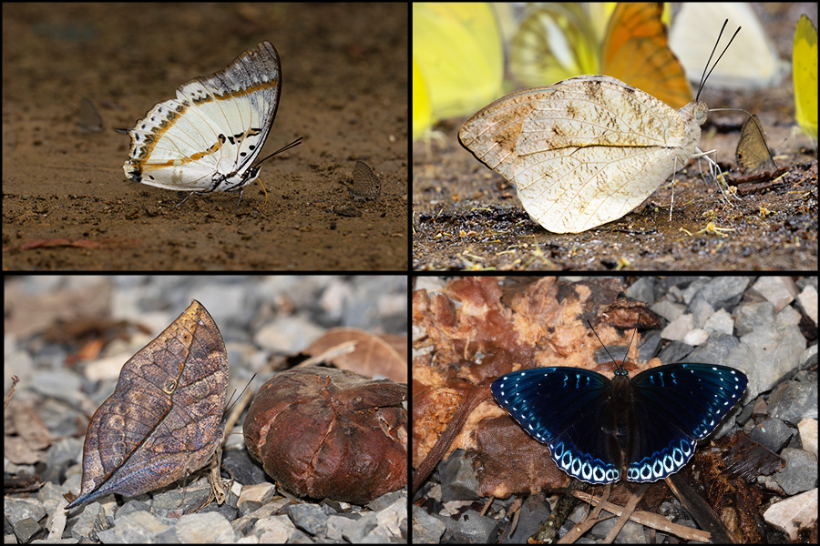
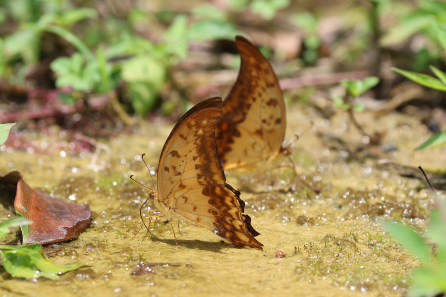
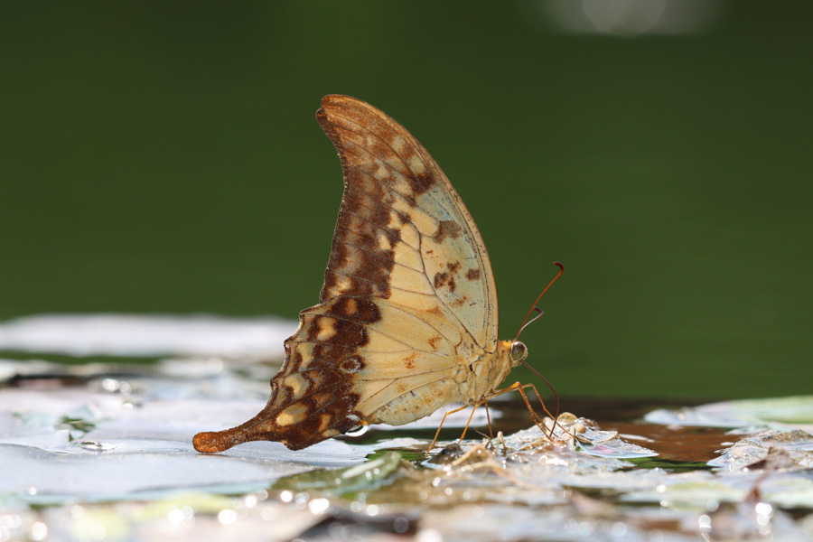
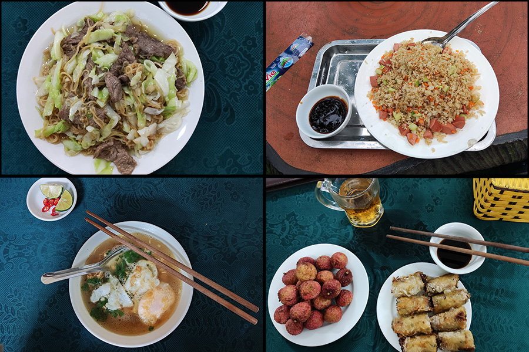
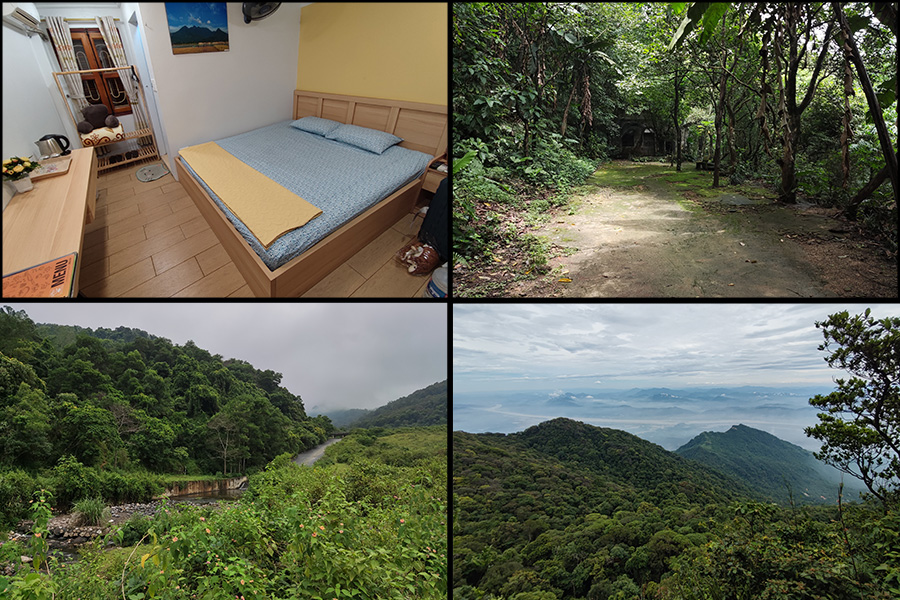
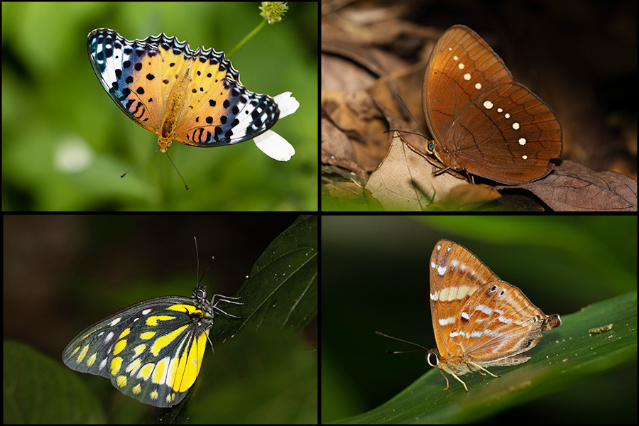
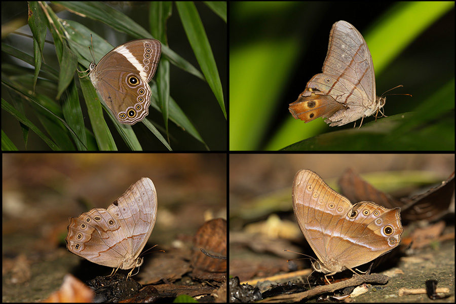
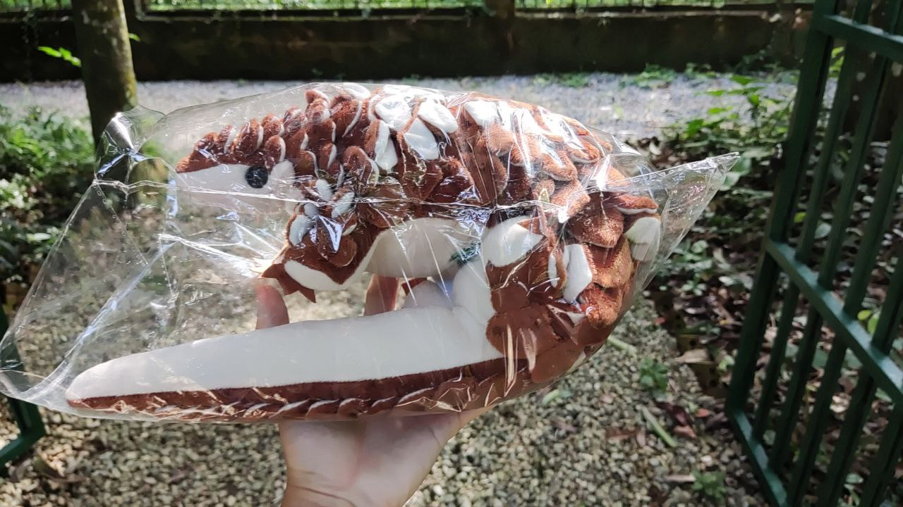

```{r setup, include=FALSE}
knitr::opts_chunk$set(echo = TRUE)
library(XML)
library(leaflet)
library(here)
library(tidyverse)
library("kableExtra")
```


## North Vietnam 2023 Butterfly trip report

### Vietnam Overview
Vietnam is home to more than 1200 species of butterflies, a number similar to Thailand and Malaysia. However, it remains a lesser popular destination for Singapore butterfly enthusiasts perhaps due to a lack of easily available information in English. For this trip, I decided to focus on two areas not far from Hanoi, Cuc Phuong National Park (CPNP) and Ba Vi National Park (BVNP). CPNP, Vietnam's first national park, is typical lowland tropical rainforest. BVNP (altitude ~200-1300m) has a transition towards submontane forests. Even though the two locations are not too far apart, I hoped to find some difference species in the two areas. 
While planning this trip, I faced some difficulties in  finding a comprehensive checklist. Cat Tien National Park in the south had a nice checklist of about 450 species but I could not find a similar checklist for CPNP and BVNP. The closest was a 2003 article which listed the number of butterflies of each genera (total ~400sp) that can be found in CPNP. There are also a few shorter lists by hobbyists and journal articles.

I decided to explore these two parks from 17th to 24th June 2023. The first four days (17th-20th June) were spent in CPNP, the next 2.5 days (21st-23rd June) in BVNP and the last day in Hanoi. My main targets for this trip were the yellow gorgon (*Meandrusa payeni*), jungle queens (*Stichophthalma spp*) and *Lethe spp*. The paths I took for the following days can be found in the maps below.

### Cuc Phuong National Park (17th-20th June)
#### Day 1 and arrival
I arranged transport and accommodations at CPNP directly through the park via email. For the rooms, I opted for the third class rooms (500k - 600k VND/night). The process was rather straightforward despite a little language barrier.

After a little hiccups, I met the driver at Hanoi's Noi Bai International Airport at 2.30pm. It was a 3.5 hour drive to CPNP and it was already 6pm by the time I arrived. The trip looked off to a good start with two *Penthema darlisas* in the park HQ office. Since I had arrivedd a little later than expected, I decided to do a self-guided night walk (a guided nightwalk organised by the park would cost 800k VND). After settling down in my room and a quick dinner at the restaurant, I set off on my walk around the HQ. I managed to find a few *Eurema spp*, lemons emigrants (*Catopsilia pomona*) and *Penthema darlisa* but my search for mammals and herptiles were unsuccessful.  


```{r echo=FALSE, results='hide',fig.show='hide'} 
#Chunk to use GPS data for the days. Convert .log to .gpx first
#day1
gpx_parsed1 <- htmlTreeParse(file = "GPS/Vn2023/Day1.gpx", useInternalNodes = TRUE)
coords1 <- xpathSApply(doc = gpx_parsed1, path = "//trkpt", fun = xmlAttrs)
elevation1 <- xpathSApply(doc = gpx_parsed1, path = "//trkpt/ele", fun = xmlValue)

df1 <- data.frame(
  lat = as.numeric(coords1["lat", ]),
  lon = as.numeric(coords1["lon", ]),
  elevation = as.numeric(elevation1)
)

#day2
gpx_parsed2 <- htmlTreeParse(file = "GPS/Vn2023/Day2_Edited.gpx", useInternalNodes = TRUE)
coords2 <- xpathSApply(doc = gpx_parsed2, path = "//trkpt", fun = xmlAttrs)
elevation2 <- xpathSApply(doc = gpx_parsed2, path = "//trkpt/ele", fun = xmlValue)

df2 <- data.frame(
  lat = as.numeric(coords2["lat", ]),
  lon = as.numeric(coords2["lon", ]),
  elevation = as.numeric(elevation2)
)

#day3
gpx_parsed3 <- htmlTreeParse(file = "GPS/Vn2023/Day3.gpx", useInternalNodes = TRUE)
coords3 <- xpathSApply(doc = gpx_parsed3, path = "//trkpt", fun = xmlAttrs)
elevation3 <- xpathSApply(doc = gpx_parsed3, path = "//trkpt/ele", fun = xmlValue)

df3 <- data.frame(
  lat = as.numeric(coords3["lat", ]),
  lon = as.numeric(coords3["lon", ]),
  elevation = as.numeric(elevation3)
)

#day4
gpx_parsed4 <- htmlTreeParse(file = "GPS/Vn2023/Day4_orgtimestamp.gpx", useInternalNodes = TRUE)
coords4 <- xpathSApply(doc = gpx_parsed4, path = "//trkpt", fun = xmlAttrs)
elevation4 <- xpathSApply(doc = gpx_parsed4, path = "//trkpt/ele", fun = xmlValue)

df4 <- data.frame(
  lat = as.numeric(coords4["lat", ]),
  lon = as.numeric(coords4["lon", ]),
  elevation = as.numeric(elevation4)
)

#day5
gpx_parsed5 <- htmlTreeParse(file = "GPS/Vn2023/Day5_Edited.gpx", useInternalNodes = TRUE)
coords5 <- xpathSApply(doc = gpx_parsed5, path = "//trkpt", fun = xmlAttrs)
elevation5 <- xpathSApply(doc = gpx_parsed5, path = "//trkpt/ele", fun = xmlValue)

df5 <- data.frame(
  lat = as.numeric(coords5["lat", ]),
  lon = as.numeric(coords5["lon", ]),
  elevation = as.numeric(elevation5)
)

#day6
gpx_parsed6 <- htmlTreeParse(file = "GPS/Vn2023/Day6_Edited.gpx", useInternalNodes = TRUE)
coords6 <- xpathSApply(doc = gpx_parsed6, path = "//trkpt", fun = xmlAttrs)
elevation6 <- xpathSApply(doc = gpx_parsed6, path = "//trkpt/ele", fun = xmlValue)

df6 <- data.frame(
  lat = as.numeric(coords6["lat", ]),
  lon = as.numeric(coords6["lon", ]),
  elevation = as.numeric(elevation6)
)

#day7
gpx_parsed7 <- htmlTreeParse(file = "GPS/Vn2023/Day7.gpx", useInternalNodes = TRUE)
coords7 <- xpathSApply(doc = gpx_parsed7, path = "//trkpt", fun = xmlAttrs)
elevation7 <- xpathSApply(doc = gpx_parsed7, path = "//trkpt/ele", fun = xmlValue)

df7 <- data.frame(
  lat = as.numeric(coords7["lat", ]),
  lon = as.numeric(coords7["lon", ]),
  elevation = as.numeric(elevation7))

df1 <- df1 %>%
  add_column(Day = "1")
df2 <- df2 %>%
  add_column(Day = "2")
df3 <- df3 %>%
  add_column(Day = "3")
df4 <- df4 %>%
  add_column(Day = "4")
df5 <- df5 %>%
  add_column(Day = "5")
df6 <- df6 %>%
  add_column(Day = "6")
df7 <- df7 %>%
  add_column(Day = "7")
df_merge<-bind_rows(df1,df2,df3,df4,df5,df6,df7)

#echo=FALSE, results='hide',fig.show='hide' to hide code, results and plot respectively
```

```{r echo=FALSE} 
dispal <- colorFactor("Spectral", domain = df_merge$Day, na.color = "black") # TO fix grouping

leaflet() %>%
  addTiles() %>%
  addPolylines(data=df1, lat = ~lat, lng = ~lon, opacity=1, weight = 3, group = "Day 1", 
               color='#5778a4') %>%
  addPolylines(data=df2, lat = ~lat, lng = ~lon, opacity=1, weight = 3, group = "Day 2", 
               color='#e49444') %>%
  addPolylines(data=df3, lat = ~lat, lng = ~lon, opacity=1, weight = 3, group = "Day 3", 
               color='#d1615d') %>%
  addPolylines(data=df4, lat = ~lat, lng = ~lon, opacity=1, weight = 3, group = "Day 4", 
               color='#e7ca60') %>%
  addLegend(position = "bottomright", colors=c('#5778a4', '#e49444', '#d1615d','#e7ca60'), labels =c("Day 1", "Day 2", "Day 3", "Day 4") ,
          title = "Day",
          opacity = 1)%>%
  addLayersControl(
    overlayGroups = c("Day 1", "Day 2", "Day 3", "Day 4"),
    options = layersControlOptions(collapsed = FALSE)) 


#{r, echo=FALSE,out.width="49%", 
# out.height="20%",fig.cap="caption",fig.show='hold',fig.align='center'}
# knitr::include_graphics(c("path/to/img1","path/to/img1")) #To have multiple pics in a line
```

#### Day 2
Weather: Very warm and humid. Cloudy with occasional showers.

I started the day at 8.15am and decided to explore the trails towards the animal rescue centres. As it was still rather early, butterfly activity was low but I managed to shoot the black-spotted labyrinth (*Neope muirheadii*), *Telinga malsara?*, Shan Nawab (*Polyura nepenthes*) and a few other species. 


I made my way towards Mac Lake. Along the way, there were a few puddling spots consisting of mostly Common Linblues and Tailess Lineblues (*Prosotas nora* & *P.dubiosa*) and some Papilionids. A figging tree at Mac Lake attracted a number of nice butterflies such as *Kallima incognita?* and a Poppinjay (*Stibochiona nicea*). *Penthema darlisa* were plentiful at this area, at least more than10 of them feeding on the fallen figs! The neaby firepit and roadside soil also proved popular to the Pierdids and the Papilionids. After a quick lunch at the Mac Lake restaurant (which had the same menu as the HQ restaurant), i revisited a few of the puddling spots around Mac Lake. By 3pm, the sky had turned more overcast and activity was dwindling. I decided to head back to the Park HQ and made it back just before the showers. 



#### Day 3
Weather: Cloudy, very warm. Darker at 3pm. 

For the third day of the trip, I started at 7.45am which was a little too early. I headed to the restaurant for breakfast and happened to meet a small group from Mandai. I decided to rent a bike (250k VND/day) to venture further into the park. It was a semiautomatic motorcycle with slightly different controls and it took a while for me to get used to it. The first stop was Mac Lake to check out some the sites from the previous day and the only notable addition was a Redspot Duke (*Dophla evelina*). 


Further down the road was a guard post which separated the strictly protected area from the rest of the park. The area looked very promising, with puddling spots everywhere along the road but due to  time constraints, I skipped most of these. I made a short detour up the Prehistoric Man Cave, where there was a Marbled Map (*Cyrestis cocles*) and a few flying Junglekings (*Thauria lathyi*). The parking area also had a couple of puddling spots where I found the cf. Yellow Rajah (*Charaxes marmax*). 

I arrived at Bong Substation at 12.30pm and headed to the restauramt (different menu at last!) for a quick lunch better setting off to the nearby short trail. There were some butterflies along the trail such as the Branded Yamfly and Flat. After the second rest area, I managed to find one of my targets. At least four Jungle Queens were spotted feeding on the sap of a tree. Three of them were *Stichophthalma suffusa* but the last one should be the rarer *Stichophthalma fruhstorferi* The sky startred to look very dark and that point and I was rushing down the trail. The brilliant blue of Jungle Glories (*Thaumantis diores*) stood out in the low light as they flittered around and one posed long enough for me to get a few shots off. 

 


At the end of the trail, there was a pond/reservoir where there a few few puddlers despite the weather. Three quarters around the pond, I flushed out a large, yellow butterfly. The crescent shape was distinctive even as it flew into the treeline. Luckily, I spotted another one flapping when I shifted my foot. I managed a few shots of the Yellow Gorgon (*Meandrusa payeni*) before it also flew off. I left Bong Substation at around 4.45pm and most puddlers had dispersed by then.


#### Day 4

On my last day at CPNP, I headed to the Save Vietnam Wildlife Animal Rescue Centre to get a pangolin softtoy (350kVND). I started butterflying proper at 9am at the park's botanic garden. Centaur oakblues (*Arhopala centaurus*) were common along the trail but the highlights were the three Jungleking (*Thauria lathyi*) and an Oakblue (*Arhopala aida*). Around midway through the trail, I decided to turn back and head to Bong Substation to hopefully get better pictures of the Yellow Gorgon.

I arrived at Bong Substation at 11am and headed straight to the pond. A friendly Common Maplet (*Chersonesia risa*) was happily puddling on the moist ground towards the pond. At the outlet area, amongst the massive aggregation of *Lamproptera spp* were two Yellow Gorgons (*Meandrusa payeni*)! After getting some cleaner improvement shots, I started chasing them to get some open-winged in-flight shots. The pair were very friendly and often landed nearby or at the opposite end of the pond. After more than an hour of chasing them around the pond, I managed some satisfactory shots and headed off to lunch. At the open field where the bungalows are, an Indian Fritillary (*Argynnis hyperbius*) was found visiting the *Bidens sp.*, a new species for the trip.


 


After lunch, I returned to the same pond to check if there were any new butterflies and found a total of eight Yellow Gorgons (*Meandrusa payeni*), five on one end of the pond and three on the other. I shot my fill of them before going for some of the other butterflies in the aggregations. I decided to hike up the trail as far as time permits. The start of the trail was productive, with a Blue Begum (*Prothoe franck*), Scarce Cat's Eye (*Coelites nothis*) and a friendly Jungleking (*Thauria lathyi*). I managed to make do about one third of the trail and had to turn back after shooting a Vietnamese Dark Yellow-banded Flat (*Celaenorrhinus vietnamicus*). On the way out, I spotted another new butterfly, an *Abisara sp*. I rode the 35 minutes back to the Park HQ to meet my driver for the 3 hour drive to Ba Vi National Park.


#### CPNP thoughts

1. In hindsight, I would have opted for the fourth class room which should be sufficiently comfortable and a 100k VND/night cheaper but I could not find the pictures online. The accommodations at Mac Lake can also be considered as it is closer to the deeper forest but I found it a little noisy on the first night while walking pass.
2. For future trips, it will be more productive to spend more time deeper in the forest. The aggregations in the inner areas had a similar composition to those outside but with a higher abundance. For this trip, I found it to be alright as I needed many of the common puddlers.
3. Most of the puddling took place along the main road through the park. The traffic could be rather heavy especially on the weekends which spooked the butterflies.
4. The park arranged transport felt a little expensive. It might have been possible to arrange it through a tour operator instead. 



### Ba Vi National Park (21st-23rd June)

Ba Vi National Park is about 50km northwest of Hanoi or about 120km north of CPNP. It is a popular hill station owing to its relative proximity to Hanoi. It ranges from about 200m ASL at the entrance to 1300m ASL at the highest peak in the park and offers a different forest type from the lowland forests of CPNP. Most of the accommodations are found at the foothill but there are a few more expensive resorts within the national park itself. I stayed at Bavi Homestead (375k VND/night) which is a 15 minutes walk from the park entrance. The entrance fee is 60k VND/day and an additional 10k if you are riding up.





```{r echo=FALSE} 
dispal <- colorFactor("Spectral", domain = df_merge$Day, na.color = "black") # TO fix grouping

leaflet() %>%
  addTiles() %>%
  addPolylines(data=df5, lat = ~lat, lng = ~lon, opacity = 1, weight = 3, group = "Day 5", 
               color='#5778a4') %>%
  addPolylines(data=df6, lat = ~lat, lng = ~lon, opacity = 1, weight = 3, group = "Day 6", 
               color='#e49444') %>%
  addPolylines(data=df7, lat = ~lat, lng = ~lon, opacity = 1, weight = 3, group = "Day 7", 
               color='#d1615d') %>%
  addLegend(position = "bottomright", colors=c('#5778a4', '#e49444', '#d1615d'), labels =c("Day 5", "Day 6", "Day 7") ,
          title = "Day",
          opacity = 1)%>%
  addLayersControl(
    overlayGroups = c("Day 5", "Day 6", "Day 7"),
    options = layersControlOptions(collapsed = FALSE))

#Example: {width=70%}
#{r, echo=FALSE,out.width="49%", 
# out.height="20%",fig.cap="caption",fig.show='hold',fig.align='center'}
# knitr::include_graphics(c("path/to/img1","path/to/img1")) #To have multiple pics in a line
```

#### BVNP Day 1
Weather: Morning cloudy with periods of sun, clear later. 

I started a little late at 9.15am and proceeded to the ticketing office which was around 1km from the accommodations. Similar to the first day at CPNP, I decided to walk as far as my legs would take me. The park entrance was at around 200m ASL and it was a rather gentle slope up the mountain. The start of the road was filled with Lemon Emigrants (*Catopsilia pomona*), Common Tigers (*Danaus genutia*) and *Euploea spp*.  A Yellow Flat (*Mooreana trichoneura*) was the consolation prize for the long walk up. Along the way, there were a few trails leading into the forests that I checked out. The first one had a few *Stichophthalma suffusa* and Large Fauns (*Faunis eumeus*) before I was chased out by a dog. Further up the road, there was a trail towards the botanic garden and one for the cave. The cave side had some plantings that attracted Tigers, an Indian Fritillary (*Argynnis hyperbius*) as well as a few dogfighting *Papilio paris*. The botanic garden side was more overgrown and had a few interesting butterflies including a Tailed Labyrinth (*Neope bhadra*). I turned back at the river crossing and headed up to the resort area (400-500m ASL) for lunch. I took the right side towards the Melia Resort and went into a trail along the road. The area had some odonates but only the usual butterflies. I decided to turn back at around 3.45pm and it was an uneventful 2 hour walk down.  


#### BVNP Day 2
Weather: cloudy and a little foggy in the morning.

I started the day at around 8.45am and headed to a nearby store to rent a motorcycle (250k VND/day). It was still a little foggy as I rode up to the highest point of BVNP to try and get hilltopping butterflies and more montane species. The road stops at about 1100m ASL and you would have to walk up the last 200m to reach the peaks. I made my way up towards Uncle Ho's temple (~1300m ASL), the highest peak of the mountain chain. A few *Lethe naga* and a *Lethe sinorix*  were spotted on the way to the peak. Butterfly activity started picking up at around 11am with the appearance of a few Mixed Punches (*Dodona ouida*), Commodores (*Parasarpa dudu* & *Sumalia daraxa*) and Popinjays (*Stibochiona nicea*). A new-to-me butterfly was the Purple Sapphire (*Heliophorus epicles*). I made my way back to the carpark and had lunch in one of the restaurants before going up the second peak. This peak had much less activity, only a Tailed Labyrinth (*Neope bhadra*). 



On the way down the mountain, I stopped at few promising areas. The heritage tree trail had a few Spotted Sawtooth (*Prioneris thestylis*). The Old Church area netted me another Tailed Labyrinth (*Neope bhadra*) and a Spotted Palmfly (*Elymnias malelas*). The last trail I visited was the old French camping grounds. A *Stichophthalma suffusa*, Scarce Red Forester (*Lethe distans*) and a Black Forester (*Lethe vindhya*) were found feeding on some fallen fruits. Both Lethe species were new to me. It was around 4.45pm by then and I rolled back down the mountain.



#### BVNP Day 3
Weather: Dark and overcast

There were heavy rains throughout the night which led to a few power outages. The sky was very cloudy when I woke up and I was not expecting much activity for my last half day of butterflying. I checked out and started wandering around 10am. For this day, I decided to head west. There is a pay-to-enter area that looked promising (150kVND +90k VND to rent a bicycle I think) but given the weather and that I had to return to the hotel at 1pm to meet the taxi driver, I chose to walk around the dam. I netted a few more new species here with a Courtesan (*Euripus nyctelius*), Golden Birdwing (*Troides aeacus*) and Common Mime (*Papilio clytia*) attracted to the Lantanas. Back at the hotel, I found two Redeyes (*Matapa cf. aria*) hanging around the bamboo grove before I slipped on path :). At least the camera and lens seems fine for now. After a quick lunch, I took a taxi back to Hanoi (750k VND).


#### BVNP Thoughts

1. It was a three hour trip from Cuc Phuong National Park and I arrived slightly after 8pm. Most restaurants and eateries were closed by then and the only place I could find food was a small minimart where I had cup noodles and bananas. 
2. The first day was rather wasted and I should have headed straight up to the higher elevations. At least it was good exercise. 
3. I got a few new species such as the various *Lethe*, Tailed Labyrinth (*Neope bhadra*) and Mixed Punch (*Dodona ouida*)  but overall diversity and abundance of butterflies was not high. Tam Dao National Park might have been a better option though it is quite a distance away. 


### Numbers and checklist
Currently I have 127 species identified and some individuals still left at the genus level. The list of sightings can be found on [my INaturalist](https://www.inaturalist.org/observations?d1=2023-06-17&d2=2023-06-24&place_id=6847&taxon_id=47224&user_id=weishou&verifiable=any). Help with identification would be greatly appreciated :). A checklist is provided below:

```{r echo=FALSE,}
obs <- read.csv("Supporting/Vn2023/obsVN.csv", header= T,sep = ",")
obs[is.na(obs)] <- ""
obs2 <- setNames(obs, c("Family","Scientific Name","CPNP",
                              "BVNP","Factor"))
obs3<-obs2[order(obs2$Factor),]
obs3<-obs[,c(1:4)]

obs3[,c(1:4)] %>%
  kbl(align=c('l','l','c','c'), row.names = FALSE) %>%
  kable_paper(c("hover")) %>%
  scroll_box(width = "100%", height = "600px") %>%
  kable_styling(font_size = 16)
```
*Note: Data extracted from inat on 22 July 2023* *    
      *A 1 in the table indicates presence at the site*

### Other stuff & Cost breakdown    
List of stuff I brought for the trip
Gear:\
- Canon R7\
- Sigma 150mm f2.8 macro\
- Canon 100-400 f/4.5-5.6L II\
- Canon Speedlite 600EX & 430EXII\
- Canon GP-E2\

---

Breakdown of expenditure for this trip. 

```{r echo=FALSE,}
CostDF <- read.csv("Supporting/Vn2023/CostVN.csv", header= T,sep = ",")[1:7,]
CostDF[is.na(CostDF)] <- ""
CostDF2 <- setNames(CostDF, c("Date","Transport (USD)","Transport",
                              "Accommodations","Breakfast","Lunch", "Dinner",
                              "Entrance Fee", "Other"))

CostDF2 %>%
  kbl(align="c") %>%
  kable_paper(c("hover")) %>%
  footnote(general="Values in '000VND")
```

The 350k VND was for a really cute pangolin plushie from the Save Vietnam Wildlife Rescue Centre. The 450k VND was for a copy of the Butterflies of Vietnam: An Illustrated Checklist. It is rather basic, having plates for only about 60 species but it is a nice souvenir and can join the rest of my bird field guides. 



And lastly, thanks proofreaders.
