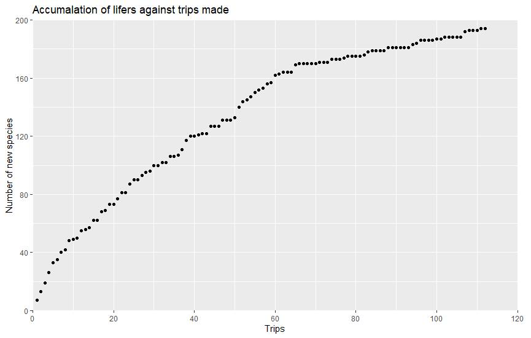
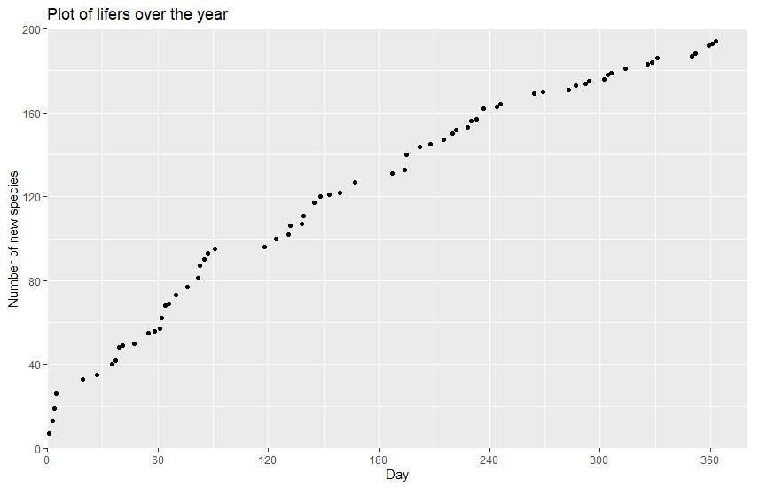

Originally posted on Facebook on 5 Oct 2021.

Been butterflying for exactly a year now and recording most of it on scythebill. The records for the first two months were only based on photos but non photographed sightings were included later in most trips. So here's my progress.
Total species: 194\
Breakdown of families (Using an older checklist)\
Papilionidae: 13/18\
Pieridae: 13/23\
Nymphalidae: 67/101 +1 ssp for jacintha eggfly\
Riodinidae: 3/5\
Lycanidae: 64/113\
Hesperiidae: 34/77\
Some highlights\
Very rares (based on Khew, 2015. Some have probably changed status by now): Malayan jester, silver royal, banded royal, malay staff sergeant, yellow chequered lancer, white tipped baron, angled castor.\
Most species in a trip: 51 species from Pulau Ubin on 27 August 2021 with two lifers (angled castor and dark cerulean).\
Latest lifer: Banded lineblue\
Thanks buttfriends\

