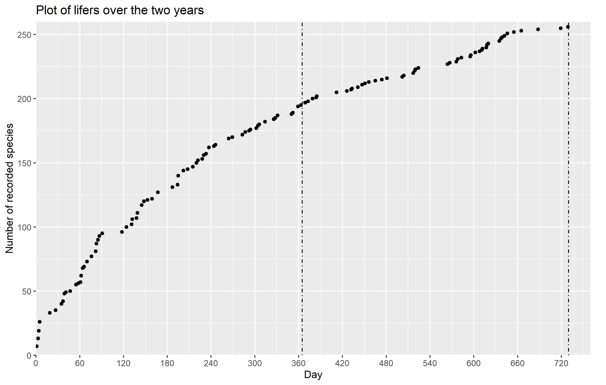
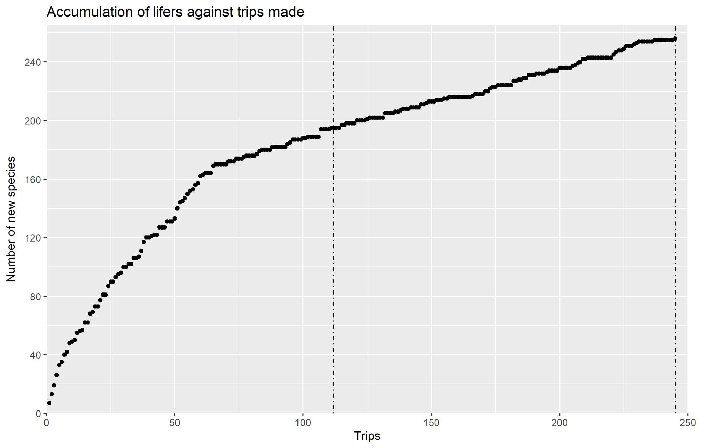

Originally posted on Facebook on 4 October 2022.

Year 2

Year 2 butterfly summary. Started on 5 Oct 2020 apparently. Numbers in the brackets show the change from Year 1.\
Number of lifers: 256 (+62)\
Number of trips made: 133\
Breakdown of families (Using a modified checklist)\
Papilionidae: 13/18 (no change)\
Pieridae: 15/23 (+2)\
Nymphalidae: 78/103 (+11)\
Riodinidae: 5/5 (+2)\
Lycanidae: 87/115 (+23)\
Hesperiidae: 58/80 (+24)\
Number of singletons: 35\
Biggest day: 61 species, 22 Jan 2022, Pulau Ubin. With Eunice and Sebastian\
Last 5 lifers: Paintbrush swift, Indian cupid, Large dart, Yellow flat, Mutal oakblue\
Some good additions: Common onyx, White club flitter, Arhopala trogon, Large metallic oakblue, Malayan oakblue, Colon swift & more. \
Additional butts: 15 from Spain. And an uncounted number from Malaysia. \
Y3 target - 275. Definitely plateauing now. \
Thanks buttfriends.\

