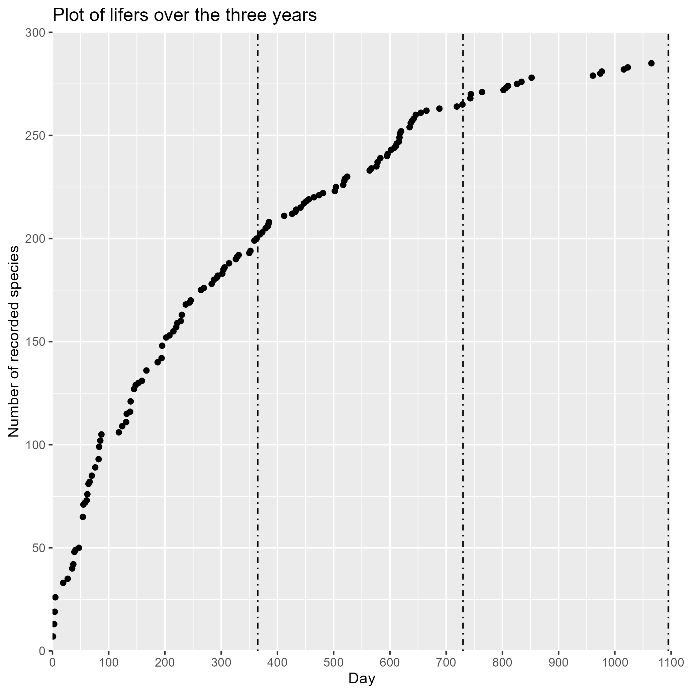
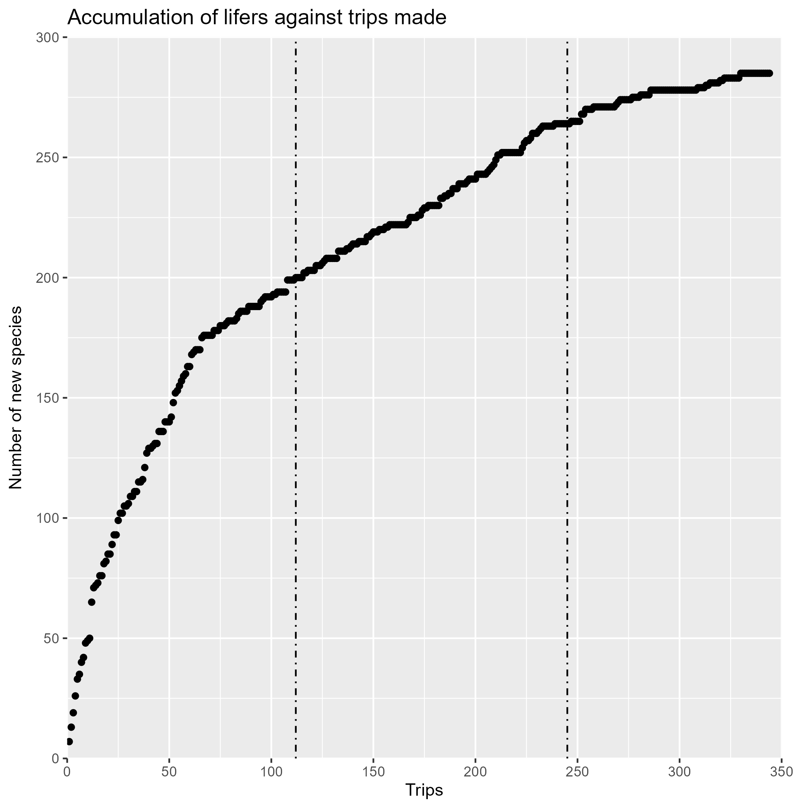

Year 3 butterfly summary. Started around 5 Oct 2020. Numbers in the brackets show the change from Year 2.
Number of lifers: 285 (+20) (includes a most likely Arhopala sublustris and Jewelled grass blue which is not yet on the checklist. Does not include a potential Curetis sperthis IDed by Dr Seow.) The numbers do not really tally with the previous summaries because I have gone back to ID some old photos. \

Number of trips made: \
Breakdown of families (Using a modified checklist)\
Papilionidae: 14/18 (+1)\
Pieridae: 15/23\
Nymphalidae: 83/103 (+5)\
Riodinidae: 5/5\
Lycanidae: 100/120 (+13)\
Hesperiidae: 62/82 (+4)\
Last 5 lifers: Striped black crow, Hoary palmer, Flash Royal, Malayan swift, Jewelled grass blue.\

Surprises:\
1)	Black rajah (Charaxes solon) at Rifle Range Link in November 2022. Got drenched for this one.\
2)	Flash royal (Tarjuria deudorix) at Ridout Road of all places.\
3)	Black striped crow (Euploea eyndhovii) in my hard disk. \

Surpassed my Year 3 target of 275 by 10 species. Year 4 target: 290. Definitely plateauing now. \

Oversea trips in this butterfly year: a week in Central Thailand and a week in north Vietnam. You may find the Vietnam post [here](https://nicholaslws.github.io/NLWSButtTrip/posts/2023-07-27-north-vietnam-2023/).\

Upcoming trips: Sabah (next week) and Sri Lanka. \

Wishlisted butterflies: Banded yeoman, Malay gem, Sky blue, Catapaecilma spp., Tarjuria dominus, Narrow spark, Suffused flash, Storey’s palmer.\

Thanks Krystal :)
