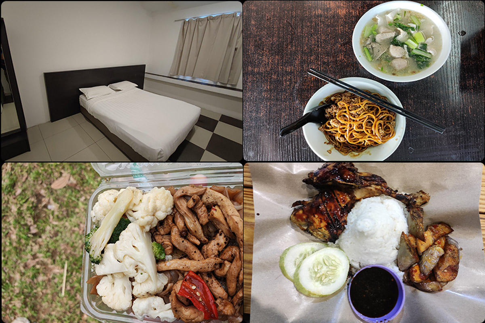
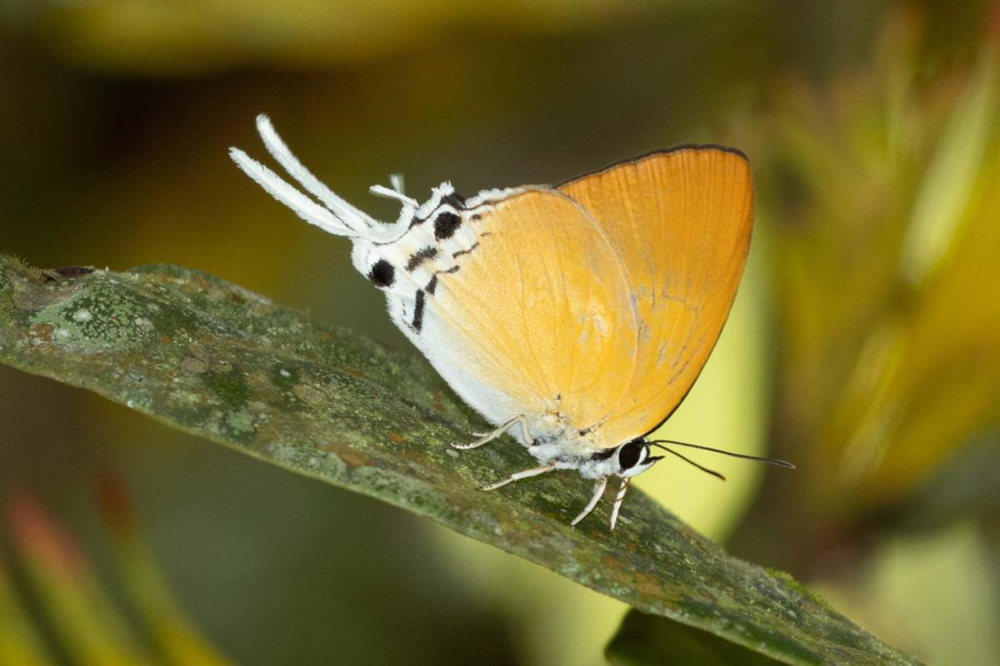
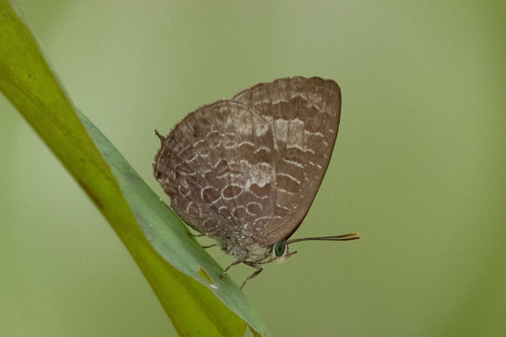
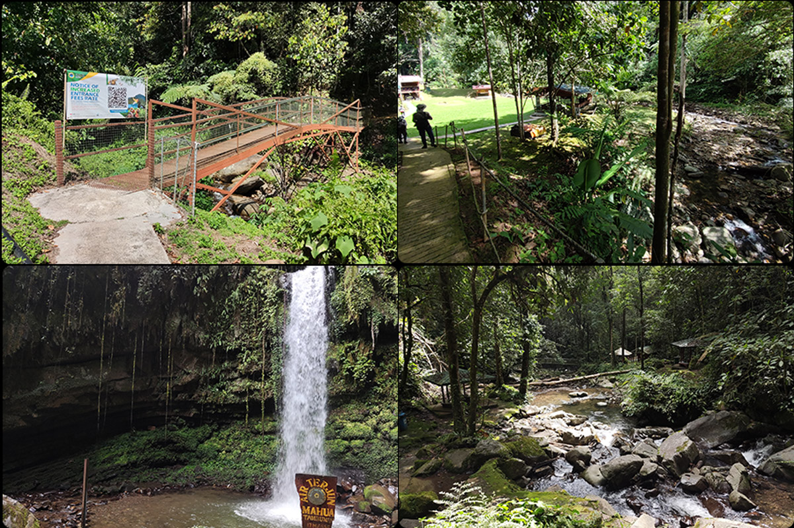
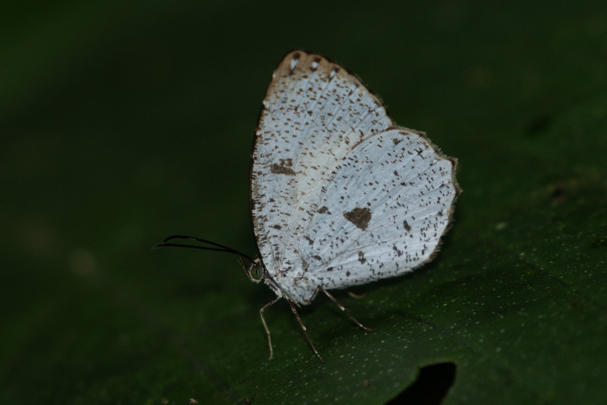
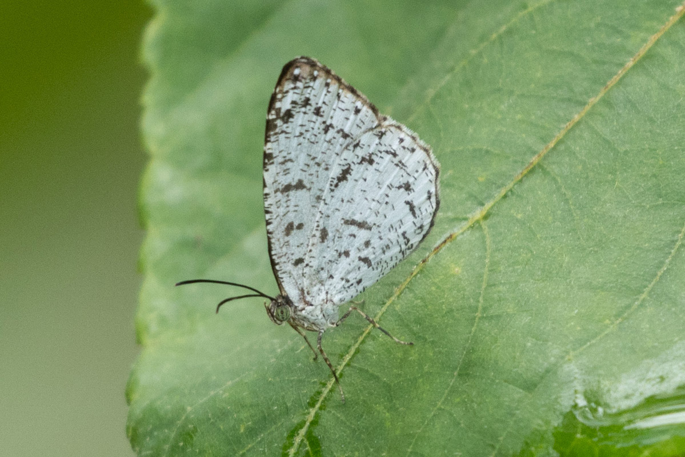
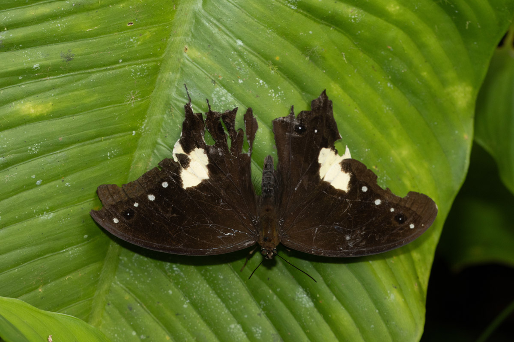
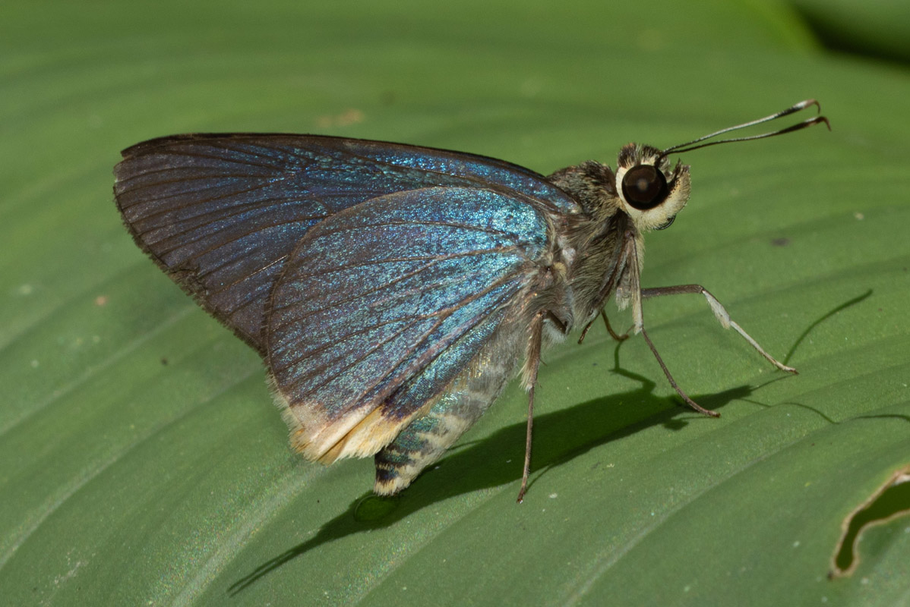
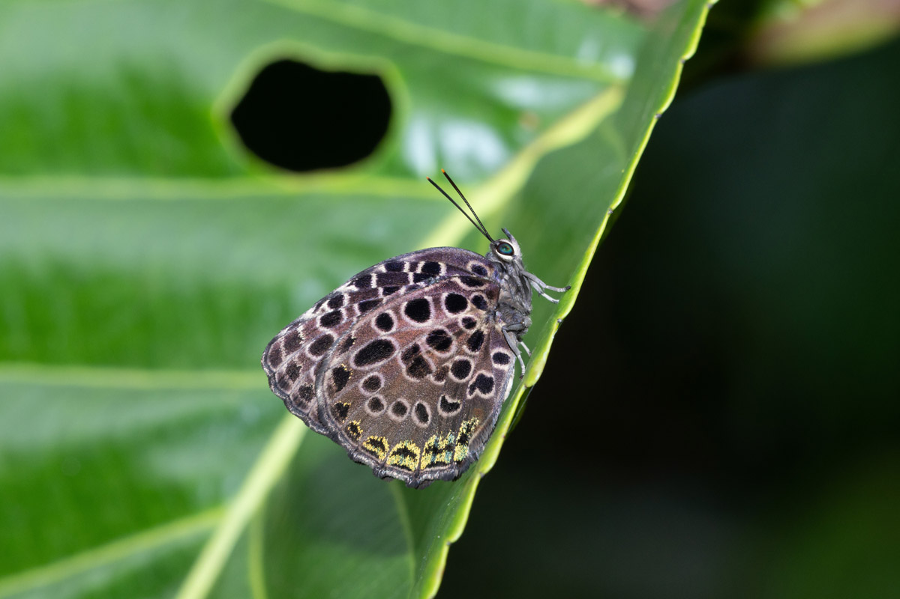

```{r setup, include=FALSE}
knitr::opts_chunk$set(echo = TRUE)
library(XML)
library(leaflet)
library(here)
library(tidyverse)
library("kableExtra")
```

## Sabah Oct 2023 Butterfly Trip Report

### Sabah Overview
Borneo is home to more than 900 species of butterflies with around 81 endemic species. It is a relatively popular butterflying area due to the species richness, endemism and relative proximity to Singapore. This was my first butterflying trip in Borneo although I have been to Mulu (Sarawak) and Tawau (Sabah) for leisure.


For this trip, I tagged along with Ash, Choy and Lee to some of the more popular butterflying sites around Crocker Range. We covered a relatively small portion of the state, with the focus being the Tambunan area (Malungung Control Post and Mahua Waterfall). Most of the sites were lowland to submontane tropical forests. 


Non-exhaustive wishlist: Endemics of course especially *Stibochiona schoenbergi*. Malayan Owl, Silky Owl, Ninja, Awlkings, Glorious Begum, Tufted Jungle King, Malayan Jungle Glory. 

### Kota Kinabalu Outskirts (9-11 Oct)
For the first part of the trip, we were based out of Kota Kinabalu and took day trips out to the sites. We stayed at KK 818 OYO which was rather dated and didn’t have many electrical outlets but was good enough (~30SGD/night). It was quite well located with malls, eateries, and a supermarket nearby.

 


```{r echo=FALSE, results='hide',fig.show='hide'} 
#Chunk to use GPS data for the days. Convert .log to .gpx first
#day1
gpx_parsed1 <- htmlTreeParse(file = "GPS/Day1.gpx", useInternalNodes = TRUE)
coords1 <- xpathSApply(doc = gpx_parsed1, path = "//trkpt", fun = xmlAttrs)
elevation1 <- xpathSApply(doc = gpx_parsed1, path = "//trkpt/ele", fun = xmlValue)

df1 <- data.frame(
  lat = as.numeric(coords1["lat", ]),
  lon = as.numeric(coords1["lon", ]),
  elevation = as.numeric(elevation1)
)

#day2
gpx_parsed2 <- htmlTreeParse(file = "GPS/Day2_edited.gpx", useInternalNodes = TRUE)
coords2 <- xpathSApply(doc = gpx_parsed2, path = "//trkpt", fun = xmlAttrs)
elevation2 <- xpathSApply(doc = gpx_parsed2, path = "//trkpt/ele", fun = xmlValue)

df2 <- data.frame(
  lat = as.numeric(coords2["lat", ]),
  lon = as.numeric(coords2["lon", ]),
  elevation = as.numeric(elevation2)
)

#day3
gpx_parsed3 <- htmlTreeParse(file = "GPS/Day3.gpx", useInternalNodes = TRUE)
coords3 <- xpathSApply(doc = gpx_parsed3, path = "//trkpt", fun = xmlAttrs)
elevation3 <- xpathSApply(doc = gpx_parsed3, path = "//trkpt/ele", fun = xmlValue)

df3 <- data.frame(
  lat = as.numeric(coords3["lat", ]),
  lon = as.numeric(coords3["lon", ]),
  elevation = as.numeric(elevation3)
)

#day4
gpx_parsed4 <- htmlTreeParse(file = "GPS/Day4.gpx", useInternalNodes = TRUE)
coords4 <- xpathSApply(doc = gpx_parsed4, path = "//trkpt", fun = xmlAttrs)
elevation4 <- xpathSApply(doc = gpx_parsed4, path = "//trkpt/ele", fun = xmlValue)

df4 <- data.frame(
  lat = as.numeric(coords4["lat", ]),
  lon = as.numeric(coords4["lon", ]),
  elevation = as.numeric(elevation4)
)

#day5
gpx_parsed5 <- htmlTreeParse(file = "GPS/Day5.gpx", useInternalNodes = TRUE)
coords5 <- xpathSApply(doc = gpx_parsed5, path = "//trkpt", fun = xmlAttrs)
elevation5 <- xpathSApply(doc = gpx_parsed5, path = "//trkpt/ele", fun = xmlValue)

df5 <- data.frame(
  lat = as.numeric(coords5["lat", ]),
  lon = as.numeric(coords5["lon", ]),
  elevation = as.numeric(elevation5)
)

#day6
gpx_parsed6 <- htmlTreeParse(file = "GPS/Day6.gpx", useInternalNodes = TRUE)
coords6 <- xpathSApply(doc = gpx_parsed6, path = "//trkpt", fun = xmlAttrs)
elevation6 <- xpathSApply(doc = gpx_parsed6, path = "//trkpt/ele", fun = xmlValue)

df6 <- data.frame(
  lat = as.numeric(coords6["lat", ]),
  lon = as.numeric(coords6["lon", ]),
  elevation = as.numeric(elevation6)
)

#day7
gpx_parsed7 <- htmlTreeParse(file = "GPS/Day7.gpx", useInternalNodes = TRUE)
coords7 <- xpathSApply(doc = gpx_parsed7, path = "//trkpt", fun = xmlAttrs)
elevation7 <- xpathSApply(doc = gpx_parsed7, path = "//trkpt/ele", fun = xmlValue)

df7 <- data.frame(
  lat = as.numeric(coords7["lat", ]),
  lon = as.numeric(coords7["lon", ]),
  elevation = as.numeric(elevation7))

df1 <- df1 %>%
  add_column(Day = "1")
df2 <- df2 %>%
  add_column(Day = "2")
df3 <- df3 %>%
  add_column(Day = "3")
df4 <- df4 %>%
  add_column(Day = "4")
df5 <- df5 %>%
  add_column(Day = "5")
df6 <- df6 %>%
  add_column(Day = "6")
df7 <- df7 %>%
  add_column(Day = "7")
df_merge<-bind_rows(df1,df2,df3,df4,df5,df6,df7)

#echo=FALSE, results='hide',fig.show='hide' to hide code, results and plot respectively
```


```{r echo=FALSE} 
dispal <- colorFactor("Spectral", domain = df_merge$Day, na.color = "black") # TO fix grouping

leaflet() %>%
  addTiles() %>%
  addPolylines(data=df1, lat = ~lat, lng = ~lon, opacity=1, weight = 3, group = "Day 1", 
               color='#5778a4') %>%
  addPolylines(data=df2, lat = ~lat, lng = ~lon, opacity=1, weight = 3, group = "Day 2", 
               color='#e49444') %>%
  addPolylines(data=df3, lat = ~lat, lng = ~lon, opacity=1, weight = 3, group = "Day 3", 
               color='#d1615d') %>%
  addLegend(position = "bottomright", colors=c('#5778a4', '#e49444', '#d1615d'), labels =c("Day 1", "Day 2", "Day 3") ,
          title = "Day",
          opacity = 1)%>%
  addLayersControl(
    overlayGroups = c("Day 1", "Day 2", "Day 3"),
    options = layersControlOptions(collapsed = FALSE)) 


#{r, echo=FALSE,out.width="49%", 
# out.height="20%",fig.cap="caption",fig.show='hold',fig.align='center'}
# knitr::include_graphics(c("path/to/img1","path/to/img1")) #To have multiple pics in a line
```


#### Day 1: Tun Fuad Stephen Park/ Shalom Valley Park
Weather: Sunny, cloudy

 

The flight was slightly delayed and we landed at KK at ~1130hrs. After meeting the driver and quick Sheng Rou Mian lunch, we headed off to Tun Faud Stephen Park. At the carpark, we found a Veined Grass Dart (*Taractrocera luzonensis*) and an Ancrya Blue. However, the trails are closed until 2024. We decided to change locations to Shalom Valley Park which was a half hour drive away. Shalom Valley Park is a small recreational area beside a forest with a small river running through the place. It even has a rabbit area. We were charged a ~10rm entrance fee. One of the first butterflies we spotted was the Green Imperial (*Manto hypoleuca*) feeding on some mistletoe on an *Andira inermis* (unsure). While wandering around the area, a friendly Common Sergeant (*Athyma perius*) allowed for some shots. There were many Troides flying around but the one I managed to shoot turned out to be a Malayan Birdwing (*Troides amphrysus*). The last highlights were the probable Tawny Bushhbrowns (**Mydosama cf. anapita*) which seem attracted to some fallen rambutans. 

 

#### Day 2: Kiulu Rainforest Park & Mari Mari Cultural Forest (~200m ASL)
Weather: Clear, showers in afternoon then cloudy


We set off at 8am from KK to Kiulu Rainforest Park (25rm entrance fee) which was an hour’s drive away. It is quite a large recreational area in the forest with chalets and other amenities which looked quite well maintained. We baited along the river while exploring the other parts of the park. Along the trail further in, a skittish Tufted Jungle King (*Thauria aliris*) was attracted to some fallen fruit but unfortunately, it did not stay for shots. There were lots of lantern bugs nearby as well. Further in, there was a clearing with some skippers and Jamides (*J. aratus & J. talinga*). Back at the bait site, a Bornean Straight Pierrot (*Caleta manovus*) was puddling. I decided to hike up to the canopy walk. There were some interesting butterflies along the way, but only a Yellow Baron (*Euthalia kanda*) perched for shots. While I was doing the canopy walk, the others had spotted a Silky Owl (*Taenaris horsfieldii*) near some shelters.  I did not see it but got my first Common Tree Nymph (*Idea stolli*) and a Yellow Archduke (*Lexias canescens*). The latter was quite different from what we usually see in Singapore, with much wider markings. We decided to change locations after lunch and went back outside. The carpark had a few Bornean Straight Pierrot, Rajah Brooke’s Birdwing and some other puddlers. 

 


Around 1300hrs, we arrived at the Kiulu rafting area but the only butterfly in the hour we waited was a Great Mormon. We moved on to Mari Mari Cultural Village. There were some showers on the way and the skies became very cloudy. However, Mari Mari Cultural Village has a 100rm entrance fee and we did not want to pay that in such overcast weather. We hung around the outside shooting a Purple Bushbrown and a Striped Ringlet before turning back at 1545hrs. 

 

#### Day 3: Kokol Haven Resort & Ulu Kionsom Waterfall (~800m ASL)
Partly cloudy in the morning, heavy rains in the afternoon

For the last day in KK, we left the hotel at 8am for the 40min drive to Kokol Haven Resort (~800m ASL, 10rm entrance fee). Upon arriving, we headed straight to the jungle trekking area, a very small patch of forest with a trail (around 15mins of slow walking). Ash and Lee spotted a biggish yellow butterfly that might have been a Gorgon but none of us managed to get a shot of it. There were quite a few Caeruleans and Banded Yeomans (*Cirrochroa orissa*) flitting around the trail. The bridge proved quite productive with a Witch (*Araotes lapithis*) and an endemic *Tanaecia orphne*. Outside the trail, Ash found a fruiting longan tree that was attracting several butterflies and called us over. We got one of the highlights of the day there, a Distant’s/Spotted Silverstreak (*Iraota distanti*). It was quite shy but returned several times giving us some opportunities for photos. Shortly after, we spotted a White Four-lined Blue (*Nacaduba angusta*) perched on a high branch. I decided to head back to the trail and spotted an *Arhopala paraganesa* along the way. 

 

It was skittish to flash but stayed around long enough for everyone to get some shots. Along the trail, a confiding, small caerulean was perched on some grass. It turned out to be the endemic *Jamides lugine* which has a distinctive purple upperside! Due to the approaching dark clouds, we headed to the restaurant for a relaxing two-hour lunch. Once the rain ended, we decided to check out the nearby Ulu Kionsom waterfall (10rm entrance fee). With the overcast weather and the crowd of picnickers, it was not very productive. I managed to shoot one of my targets, the Malayan Jungle Glory (*Thaumantis odana*) after the flight of stairs. We headed back early as there wasn’t much butterfly activity in those conditions. 

 

### Part 2 Tambunan (12-15 Oct)
The room was basic but clean and seems to have been much improved from the last time Ash stayed here. The tap water was mostly alright and there was a heater water for showers. It gets quite cold at night; I slept in my raincoat, socks and two blankets with the fan turned off. The lodge’s porch lights also attracted a number of interesting bugs (moths, Megaloptera, Neuroptera, Trichoptera). Food was flexible, tasty, cheap and fruity. Each meal was around 60-70rm for four people. The only downside is that there isn't phone reception there.

 


```{r echo=FALSE} 
dispal <- colorFactor("Spectral", domain = df_merge$Day, na.color = "black") # TO fix grouping

leaflet() %>%
  addTiles() %>%
  addPolylines(data=df4, lat = ~lat, lng = ~lon, opacity=1, weight = 3, group = "Day 4", 
               color='#5778a4') %>%
  addPolylines(data=df5, lat = ~lat, lng = ~lon, opacity=1, weight = 3, group = "Day 5", 
               color='#e49444') %>%
  addPolylines(data=df6, lat = ~lat, lng = ~lon, opacity=1, weight = 3, group = "Day 6", 
               color='#d1615d') %>%
  addPolylines(data=df7, lat = ~lat, lng = ~lon, opacity=1, weight = 3, group = "Day 7", 
               color='#e7ca60') %>%
  addLegend(position = "bottomright", colors=c('#5778a4', '#e49444', '#d1615d','#e7ca60'), labels =c("Day 4", "Day 5", "Day 6", "Day 7") ,
          title = "Day",
          opacity = 1)%>%
  addLayersControl(
    overlayGroups = c("Day 4", "Day 5", "Day 6", "Day 7"),
    options = layersControlOptions(collapsed = FALSE)) 


#{r, echo=FALSE,out.width="49%", 
# out.height="20%",fig.cap="caption",fig.show='hold',fig.align='center'}
# knitr::include_graphics(c("path/to/img1","path/to/img1")) #To have multiple pics in a line
```

#### Day 4: Malungung Control Post (~850m ASL)
Mostly cloudy-overcast

 

We set off from KK at 0730hrs to Malungung Control Post.  It is a 2.5hr journey by car depending on the traffic and we arrived around 10am. We shot a Green Awl (*Hasora salanga*) and some other butterflies around the station before entering the trail. Along the river opposite the ranger station, there were some puddlers already there including a male Silver Royal (*Ancema blanka*). We placed some bait and a Banded Angle (*Odontoptilum pygela*) immediately joined in. There were the typical hedge blues and Prosotas in small numbers. Near the start of the trail, we spotted a confiding Eyed Cyclops (*Erites argentina*) and a Broad Striped Faun (*Faunis kirata*), both lifers for me. We then went further in and crossed the river two more times (three times total) but did not spot much butterflies along the way and turned back. On the way out, Lee spotted a Banded Bushbrown (*Mycalesis maianeas*) and a Bornean Oakleaf (*Kallima buxtoni*). We decided to head to Mahua as activity was getting a little quiet. Just after the shelter, Chan spotted a Silky Owl (*Taenaris horsfieldii*) perched high but open. After securing some record shots, we scrambled up the sides of the slope to get eye-level shots!

 

After the excitement of the Silky Owl, it turned out that the driver had gone out for lunch. While waiting for him to return, I explored a path near the entrance which we had skipped earlier. Around 50m from the entrance, an Allotinus landed near me. I got a couple of record shots and suspecting that it was *A. brooksi*, went to call the others. We went back in search of it but it had flown off and settled with a Rounded Mottle (*Logania regina*) as a consolation prize. The driver returned soon after and we headed to Mahua which was an hour’s drive away. After resupplying in town, we arrived at Mahua at 4pm. 

 

#### Day 5: Mahua (~1100m ASL)
Mostly cloudy, brief showers.

Since we stayed right outside the waterfall, I started around 0730hrs for the following days. The early morning butterflies were mainly *Hasora spp.* and sunbathing *Mycalesis pitana*. We spotted another Silky Owl before going for breakfast. While eating, Lee found a cute *Udara dilectissima* on the mulberry tree near the restaurant. After a quick breakfast, we checked the carpark for puddlers before heading towards the waterfall (20rm/3day). Forest Quakers (*Pithecops corvus*) were common on the wildflowers outside. The trails around the waterfall were quiet, but I obtained better shots of the Bornean Oakleaf and the Yellow-barred Pan (*Xanthotaenia busiris*).
Back outside, several puddlers had arrived including a Bornean Sawtooth (*Prioneris cornelia*), and a very tattered Kinabalu Swordtail (*Pathysa stratiotes*). 

 

The platform was quite fruitful with a Banded Peacock (*Papilio Palinurus*), Yellow Jezebel (*Appias cardena*) and Blue Banded Pierrot (*Discolampa ethion*). The Banded Peacock returned several times before resting on a nearby bush, giving opportunities for upperwing shots. Right before lunch, a rather pristine Kinabalu Swordtail landed at the carpark and gave everyone opportunities to get some shots. We went for lunch when it started showering. After the rain ended, I went back into the forest and only got a bad angle of a Ninja (*Amnosia decora*). The last highlight of the day was an Allotinus near the ticketing office which we later identified as A. otsukai, another endemic. 

 

 

#### 6: Mahua
Morning sunny, afternoon rainy and foggy.

This morning, I went for improvement shots of M. pitana. Chan spotted a torn *Simiskina pharyge*, the first for the trip. A Kinabalu Swordtail and Banded Angle were puddling at platform, and I mainly tried for openwing shots of the Swordtail. Along the trail to the waterfall, we spotted a male Ninja sunning but otherwise the trail was quiet. At the platform, two friendly Borneo Birdwings were puddling (*Troides andromache*). We soon went for lunch when it started drizzling. The Kinabalu Swordtail was still at the platform even in the rain. As the weather was worsening, the others went back to rest while I explored the road back towards the kampung. I also gave up at 1600hrs and went back to do some IDing. 


#### Day 7: Mahua - Flight home
Mostly sunny-cloudy

As expected, the weather on the last day was better than the past few days. As there was an accident at the waterfall yesterday, the rangers had to close off the waterfall. However, the guy told us that we could still go around the outer area so we mainly walked between the carpark and the front part of forest (as shown on the map above). Near the ticketing office, a rather worn Malayan Owl (*Neorina lowii*) was sunning which was a lifer for me and my second bird of the trip. 



Ash alerted me to a puddling Bornean Mormo (*Papilio acheron*) at the platform which I had been trying to get since I missed it on the first day at Mahua. A tattered great Mormon soon joined it. Inside the forest trail again I shot a *Celaenorrhinus* and a Kinabalu Ringlet (*Ragadia annulata*) that briefly landed a few meters away from me. I went out to inform the others and they hurriedly waved me over for an oakblue near the carpark shelter. It was a friendly *Arhopala kinabala*! It was quite windy but it stayed perched on a leaf two meters up. I went to get a chair over to get a better angle. While the others continued to shoot it, I went back into the forest. Not 100m from the entrance, I saw a sunbathing skipper with a yellow tornal area and thought it was an Awlking. Upon noticing me, it closed up and I got some shots of the underside. I then realised it was the endemic *Pirdana albicornis*. I ran out to get the others but as usual it was too late and we couldn’t find it. 



During lunch, Lee spotted another oakblue at mulberry tree which he thought is another *A. kinabala* but it flew off before we could get shots. After lunch, we wandered around but there weren’t any new additions. The *A. kinabala* was still around and had shifted to a lower perch. It stayed for more than 2 hours! As we had arranged to meet the driver at 1500hrs, we went back to take a shower and pack up for the trip back to airport.




### Numbers and checklist

The list of sightings can be found on [my INaturalist](https://www.inaturalist.org/observations?d1=2023-10-09&d2=2023-10-15&place_id=any&subview=table&taxon_id=47224&user_id=weishou&verifiable=any).

```{r echo=FALSE,}
obs <- read.csv("Supporting/obsSabah.csv", header= T,sep = ",")
obs[is.na(obs)] <- ""
obs2 <- setNames(obs, c("Family","Scientific Name","9 Oct",
                              "10 Oct", "11 Oct", "12 Oct", "13 Oct",
                              "14 Oct","15 Oct", "Factor"))
obs3<-obs2[order(obs2$Factor),]
obs3<-obs[,c(1:9)]
obs3<- setNames(obs3, c("Family","Scientific Name","9 Oct",
                              "10 Oct", "11 Oct", "12 Oct", "13 Oct",
                              "14 Oct","15 Oct"))


obs3[,c(1:9)] %>%
  kbl(align=c('l','l','c','c','c','c','c' ,'c','c'), row.names = FALSE) %>%
  kable_paper(c("hover")) %>%
  scroll_box(width = "100%", height = "600px") %>%
  kable_styling(font_size = 16)
```
*Note: Data extracted from inat on 11 Nov 2023*     
      *A 1/2 in the table indicates presence at the site*
      *Only individuals identified to Species level were used included*


### Thoughts:
Thanks, Ash, for organizing the trip and logistics! Please find him to organize such trips! 
Overall, the abundance of butterflies on this trip was really quite low. The frequent afternoon rains did not help  and several afternoons were wasted. Despite baiting, aggregations did not form and most bait sites had <10 of butterflies at a time. The interior of the forests was also quiet as well. However, I got 115 species which is decent. October is probably the offseason for butterflying in Sabah and should be better in the dryer months. I didn’t manage to see couple of butterflies I wanted such as Stibochiona schoenbergi and the Bornean Sapphire (Heliophorus kiana). However, we did get some rare butterflies so it was still a good trip. My highlights were 1) the eye-level shot of the Silky Owl 2) Pirdana albicornis 3) Arhopala kinabala 4) Jamides lugine and the Allotinuses.

Next up should be a casual trip to Sri Lanka in November.


### Other stuff & Cost breakdown    
List of stuff I brought for the trip
Gear:\
- Canon R7\
- Sigma 150mm f2.8 macro\
- Canon 100-400 f/4.5-5.6L II\
- Canon Speedlite 600EX\
- Garmin GPSMAP 62S (Thanks YZ!)\

---

Breakdown of expenditure for this trip. 

```{r echo=FALSE,}
CostDF <- read.csv("Supporting/CostSabah.csv", header= T,sep = ",")[1:7,]
CostDF[is.na(CostDF)] <- ""
CostDF2 <- setNames(CostDF, c("Date","Transport",
                              "Accommodations","Meals",
                              "Entrance Fee", "Other"))

CostDF2 %>%
  kbl(align="c") %>%
  kable_paper(c("hover")) %>%
  footnote(general="Values in RM. Exchange rate of 1SGD = 3.43 RM", )
```

The flight costed $134. 
In total, I spent about $600 for this trip.


