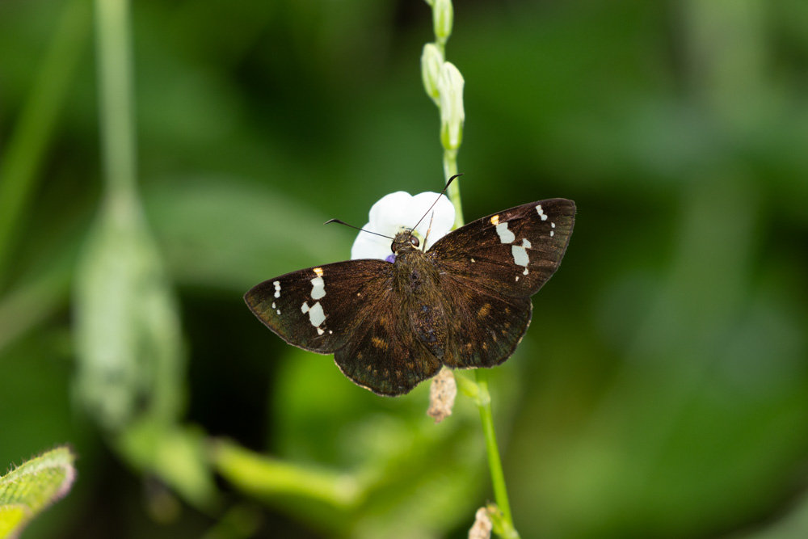
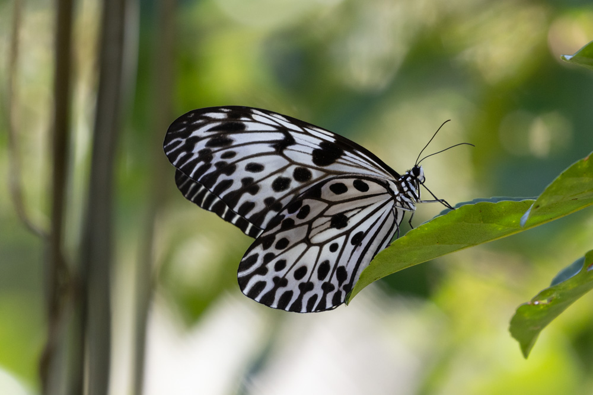
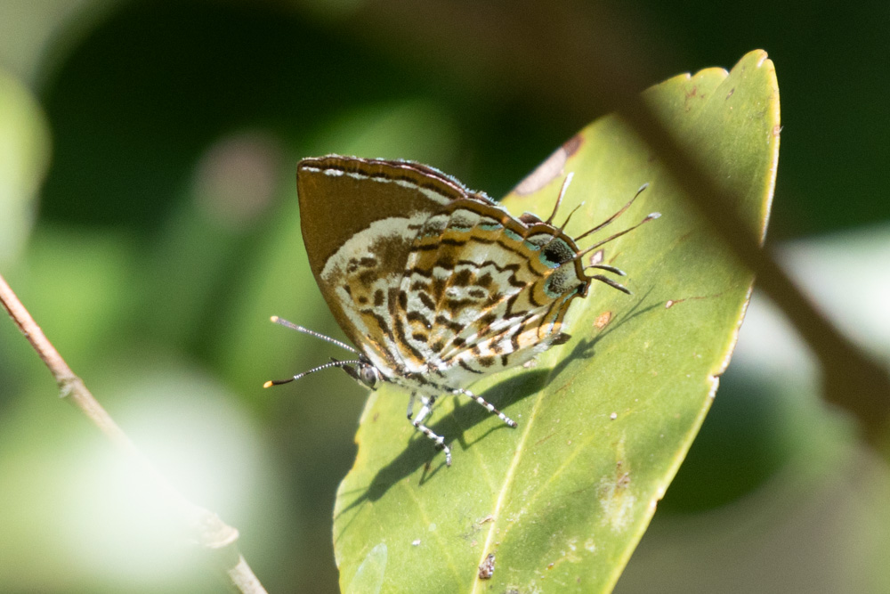
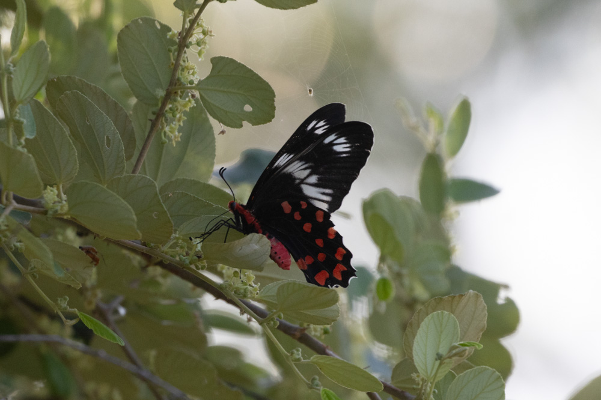
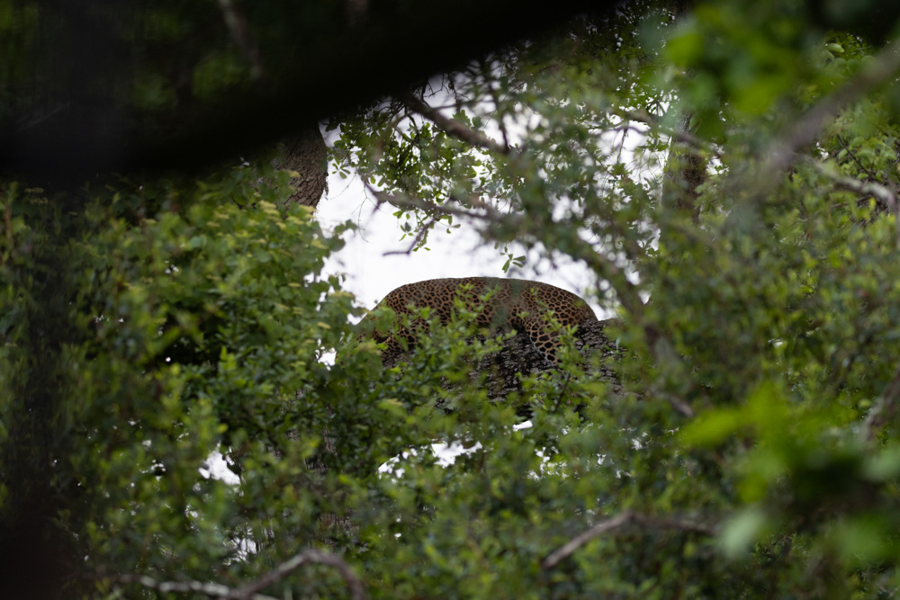
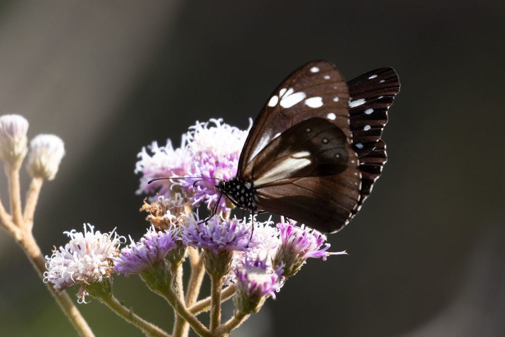
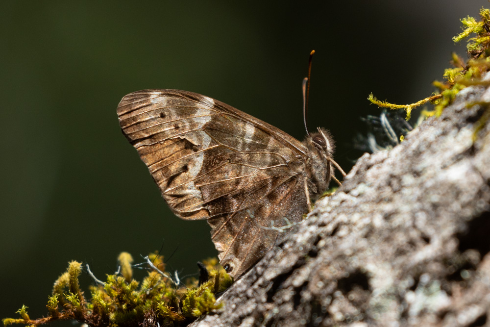

## Sri Lanka Nov 2023 Casual Butterfly Trip Report

### Overview
Sri Lanka has quite a diverse range of habitats from tropical lowland forests to cloud forests and savannahs. However, the butterfly diversity is surprisingly low at only around 240 species.

I went to Sri Lanka from 22 Nov to 2 Dec for a trip. As I was with family and not a dedicated butterfly trip, I could not devote as much time as I would like to butterflying. This post will just focus on the main areas where I could butterfly (in bold). 

Outline of route:\
1. Negombo\
2. Mirissa\
3. **Sinharaja (Pitadeniya)**\
4. **Yala**\
5. **Nuwara Eliya**\
6. Sigiriya\

### Logistics
I got the contact of a driver (Geeth) through HZ. He charges around 75USD a day and he helped to organise all the hotels, tours and food. Excellent driver, highly recommended! Hotels were approximately 50USD/night for three people. Exchange rate at that time: 1USD = 325 Sri Lankan Rupees.

### Sinharaja (Pitadeniya entrance)
This was the most expensive hotel at 80/night but at least my mum can claim to have gone glamping before. I think she prefers a normal hotel now. The guide (a half day walk in the forest + a morning birding session) was organised through the hotel which was rather expensive. 

In terms of butterflying, the forest was very quiet with some Clippers, a Commander and a Metallic Caerulean. The vertebrates were more interesting and we saw the endemic Kangaroo Lizard, Hump-nosed Lizard, whip snake and viper. For birds, we got the Spot-winged Thrush as the highlight. Based on some other reviews, the northern entrance might be better for wildlife. Overall, very quiet but it was worth it to see my mother get leeched.

After the guided walk, I had some time to explore the area near the entrance and village which was decent. The endemic *Eurema cf. ormistoni* and *Celaenorrhinus spilothyrus* were both shot there. Other butterflies include the  Angled Pierrot (*Caleta decida*) and the White Four Ring (*Ypthima ceylonica*). 

 

The next morning, we went for a guided walk around the village for birds and managed to get a few endemics. But the main site of interest was the accommodations which had a flowering Elaeocarpus sp. It attracted many Common Jezebels (*Delias eucharis*) and two endemic Ceylon Tree Nymphs (*Idea iasonia*). The rest of the gardens attracted some tigers (*Ideopsis* and *Parantica*) as well as the Blue Mormon (now a subsp. of *Papilio agenor*). 

 

### Yala National Park Block 1
We did a full-day safari at Yala Block 1 to maximise our chances of seeing a Leopard. It costed us ~150USD for the tour and another 30USD for the entrance fee. For the full day safari, it runs from about 5am - 6pm. 12-2pm is a no move time where the drivers are not allowed to move. Unfortunately, our Hilux got stuck at 11am and another vehicle could only help to pull us out at ~3pm. This gave me around some time to walk near the vehicle to look for butterflies which happened to be the most butterfly productive part of the day. The Pieridids were puddling around the trail, consisting of *Appias sp* (unsure if they were *albina* or the endemic *galene*), *Ixias* and *Euremas* etc. Highlights were the Monkey Puzzle (*Rathinda amor*), Small Salmon Arab (*Colotis amata*), White Orange Tip (*Ixias marianne*) and a Dark Wanderer (*Pareronia ceylanica*).  None of these are supposed to be rare but they were all lifers for me. The Crimson  (*Pachliopta hector*) was also common along the trails. Once we were rescued, the focus was again on birds.

 

 

Oh and a leopard right before closing time. It was a mad rush getting to the location and out of the park by 6pm.

 

### Nuwara Eliya
The main site was Horton Plains National Park (~2100m ASL). The 30USD entrance fee was worth it for the views and landscape alone. We did the standard loop around World's End trail which took a few hours. The butterfly diversity was expectedly low but I managed to get the endemic Ceylon Tiger (*Parantica taprobana*) and a suspected *Lethe cf. daretis*. The Lethe was a bit too worn though. The other butterflies were not very confiding. 

 

 

### Overall
The butterfly diversity on this trip was not very high at all with around 55 species over 10 days. At least I managed to get a few of my targets and endemics such as the Ceylon Tree Nymph and Monkey Puzzle. But overall, it was a pretty enjoyable trip. It was not a very cheap place though. 

The list of sightings can be found on [my INaturalist](https://www.inaturalist.org/observations?d1=2023-11-22&d2=2023-12-02&place_id=7077&taxon_id=47224&user_id=weishou&verifiable=any).