```{r setup, include=FALSE}
knitr::opts_chunk$set(echo = TRUE)
library(XML)
library(leaflet)
library(here)
library(tidyverse)
library("kableExtra")
```

```{r echo=FALSE, results='hide',fig.show='hide'} 
#Chunk to use GPS data for the days. Convert .log to .gpx first
#day1
gpx_parsed1 <- htmlTreeParse(file = "GPS/TW1_crop.gpx", useInternalNodes = TRUE)
coords1 <- xpathSApply(doc = gpx_parsed1, path = "//trkpt", fun = xmlAttrs)
elevation1 <- xpathSApply(doc = gpx_parsed1, path = "//trkpt/ele", fun = xmlValue)

df1 <- data.frame(
  lat = as.numeric(coords1["lat", ]),
  lon = as.numeric(coords1["lon", ]),
  elevation = as.numeric(elevation1)
)

#day2
gpx_parsed2 <- htmlTreeParse(file = "GPS/TW2_crop.gpx", useInternalNodes = TRUE)
coords2 <- xpathSApply(doc = gpx_parsed2, path = "//trkpt", fun = xmlAttrs)
elevation2 <- xpathSApply(doc = gpx_parsed2, path = "//trkpt/ele", fun = xmlValue)

df2 <- data.frame(
  lat = as.numeric(coords2["lat", ]),
  lon = as.numeric(coords2["lon", ]),
  elevation = as.numeric(elevation2)
)

#day3
gpx_parsed3 <- htmlTreeParse(file = "GPS/TW3_crop.gpx", useInternalNodes = TRUE)
coords3 <- xpathSApply(doc = gpx_parsed3, path = "//trkpt", fun = xmlAttrs)
elevation3 <- xpathSApply(doc = gpx_parsed3, path = "//trkpt/ele", fun = xmlValue)

df3 <- data.frame(
  lat = as.numeric(coords3["lat", ]),
  lon = as.numeric(coords3["lon", ]),
  elevation = as.numeric(elevation3)
)

#day4
gpx_parsed4 <- htmlTreeParse(file = "GPS/TW4_crop.gpx", useInternalNodes = TRUE)
coords4 <- xpathSApply(doc = gpx_parsed4, path = "//trkpt", fun = xmlAttrs)
elevation4 <- xpathSApply(doc = gpx_parsed4, path = "//trkpt/ele", fun = xmlValue)

df4 <- data.frame(
  lat = as.numeric(coords4["lat", ]),
  lon = as.numeric(coords4["lon", ]),
  elevation = as.numeric(elevation4)
)

#day5
gpx_parsed5 <- htmlTreeParse(file = "GPS/TW5_crop.gpx", useInternalNodes = TRUE)
coords5 <- xpathSApply(doc = gpx_parsed5, path = "//trkpt", fun = xmlAttrs)
elevation5 <- xpathSApply(doc = gpx_parsed5, path = "//trkpt/ele", fun = xmlValue)

df5 <- data.frame(
  lat = as.numeric(coords5["lat", ]),
  lon = as.numeric(coords5["lon", ]),
  elevation = as.numeric(elevation5)
)


df1 <- df1 %>%
  add_column(Day = "1")
df2 <- df2 %>%
  add_column(Day = "2")
df3 <- df3 %>%
  add_column(Day = "3")
df4 <- df4 %>%
  add_column(Day = "4")
df5 <- df5 %>%
  add_column(Day = "5")

df_merge<-bind_rows(df1,df2,df3,df4,df5)

#echo=FALSE, results='hide',fig.show='hide' to hide code, results and plot respectively
```

## Japan April 2024 trip report

### Japan Trip Overview
This was a family trip between 3rd-13th April around Tokyo - Shizuoka - Yamanashi prefectures primarily for the Sakuras.  While I was hoping to get some pictures of butterflies on the sakuras, I guess it was a bit too early in the season for butterflies. The cooler spell in March probably didn't help as well. Even the sakuras were delayed by a week compared to the 2023 dates. 

### Japan Butterflies
In total, I managed to photograph four species, of which three were lifers for me. These were the Indian Red Admiral (*Vanessa indica*), cf. Asian Green-veined White (*Pieris cf. melete*) and *Celastrina sugitanii*. The last one was just a pale grass blue. 

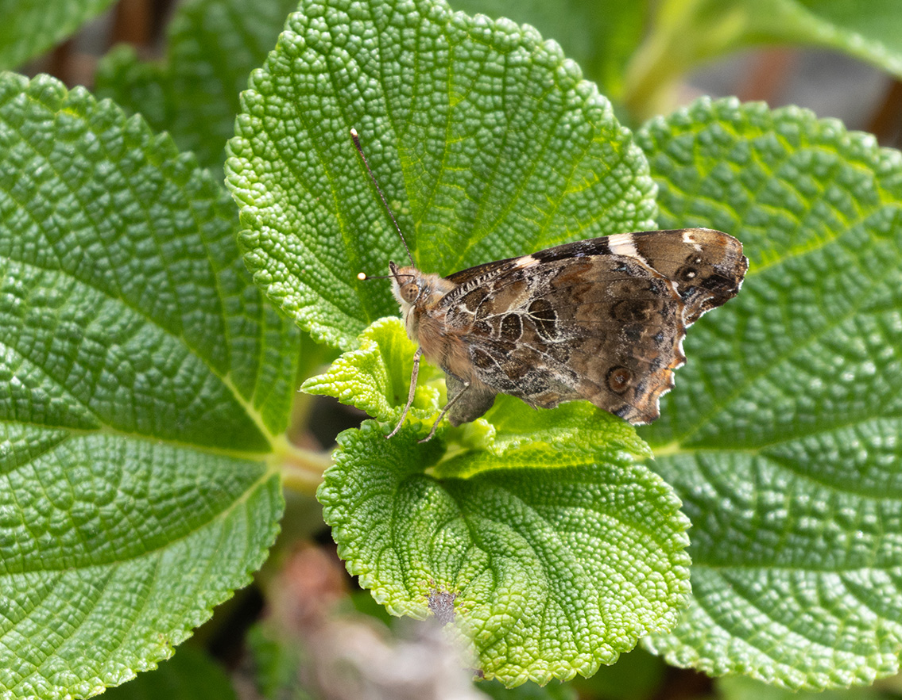

The weather during the trip was not great and most of the butterflies only appeared on the few sunny days we had. The iNat list can be found [here](https://www.inaturalist.org/observations?d1=2024-04-03&d2=2024-04-13&place_id=6737&subview=table&taxon_id=47224&user_id=weishou&verifiable=any)! I ended up getting a copy of "Papilionidae of the World" which is mostly in Japanese with genera descriptions in English. Really nice looking book.

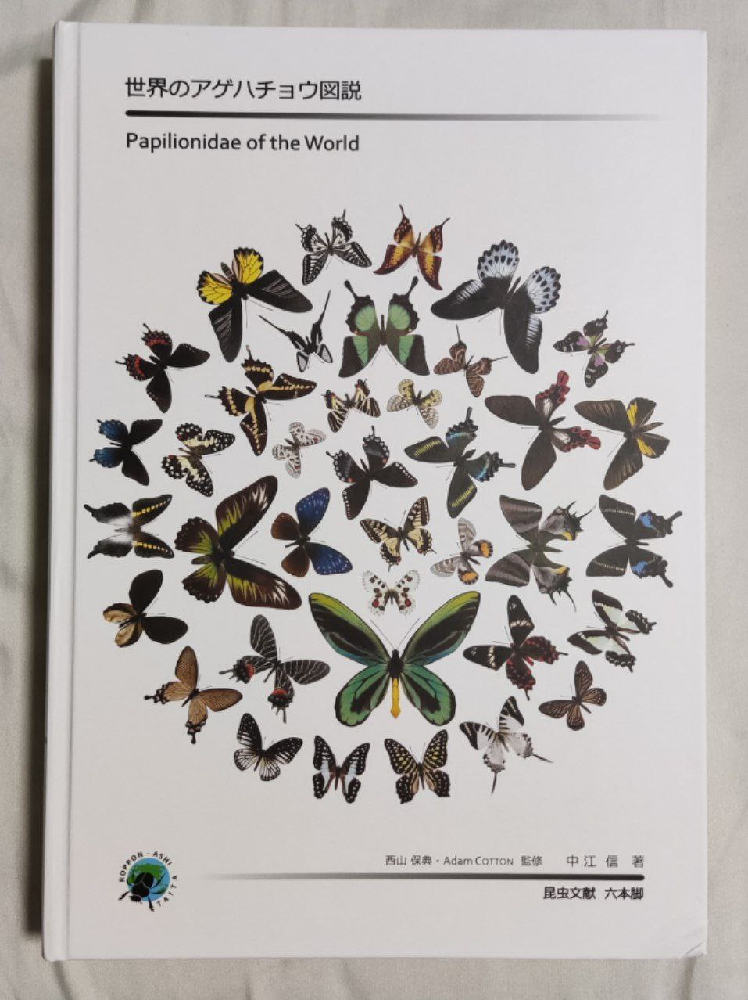


## Taiwan May 2024 Butterfly trip report

### Taiwan Trip overview
Taiwan is located at the northern end of the Indomalayan region and is home to 400 species in butterflies, with more than 50 endemics. I was mainly interested in the many interesting species of Blues there. Many of these are localised and are on the wing for only a few weeks a year, making it challenging to see these species. I decided to do a short butterflying trip from 6th - 10th May because the flights were quite cheap and its convenient to get around. Since it was only a five day trip, I decided not to go too far from the airport, with three days in the Taoyuan area and two in Taipei. Another nice thing is that field guides for five of the families (except Nymphalidae) can be found on the government's website.

### Taoyuan (6th-8th May)
#### Day 1 Arrival and Hutoushan Park (~200m ASL)
Weather: Rather cloudy    

```{r echo=FALSE} 
dispal <- colorFactor("Spectral", domain = df_merge$Day, na.color = "black") # TO fix grouping

leaflet() %>%
  addTiles() %>%
  addPolylines(data=df1, lat = ~lat, lng = ~lon, opacity=1, weight = 3, group = "Day 1", 
               color='#5778a4') %>%
  addLegend(position = "bottomright", colors=c('#5778a4'), labels =c("Day 1"),
          title = "Day",
          opacity = 1)%>%
  addLayersControl(
    overlayGroups = c("Day 1"),
    options = layersControlOptions(collapsed = FALSE)) 

#{r, echo=FALSE,out.width="49%", 
# out.height="20%",fig.cap="caption",fig.show='hold',fig.align='center'}
# knitr::include_graphics(c("path/to/img1","path/to/img1")) #To have multiple pics in a line
```


I caught the red-eye flight out of Changi and arrived in Taoyuan International Airport at 5.30am. After clearing immigration, I went to get a SIM card (5+1 day for 300NTD) as the Singtel app was down for maintenance the previous night and I didn't buy data roaming ahead of time. After a quick breakfast at the airport 7-11, I tried to catch the bus to town but the EasyCard I had had negative value. I ended up missing the 6am bus and had to catch the 7am bus. After the 45 minute ride, I dropped off my bags at the hotel (City Suites Taoyuan Station) and went for a second breakfast of beef noodles before going to Hutoushan Park.

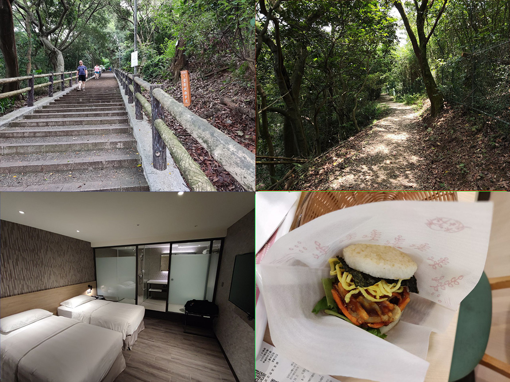

Hutoushan Park is conveniently located 20mins from Taoyuan Station. The terrain was not too difficult (think BBNP/ TBHP) which was suitable for the first day and but is not too manicured. The morning was rather cloudy and the weather forecast was not very favourable.  

The first attraction was a flock of Taiwan blue magpies not far from the entrance. The spot was a little sunny, attracting some sunbathing butterflies, mainly Limenitidinae. I followed the trails randomly, but spent a bit more time on the hilltops. Along one of the shady trails I got *Tagaides tethys*. Around noon, I  headed towards Guilunshan/ Xinlukenshan, stopping along the way at a cafe for tea with almond jelly. The cafe's tea plantation had some butterflies including the Indigo Flash, Common Beak (*Libythea lepita*) and a Pink-spotted Windmill (*Byasa impediens*). Unfortunately, I was holding my drink for the last one and did not manage to get good shots before it flew off. By then, it was almost 2pm, and I decided to get off the hill to get lunch (luroufan) and top up water. On the way down, I was greeted by a small target, the Beautiful Leopard (*Timelaea albescens*) hopping on some shrubs. 

After resupplying, I went back up towards the peak of Guilunshan/ Xinlukenshan. The trail up was guarded by many dogs, making it quite a tense walk up. A few Blue Admirals (*Kaniska canace*) were sunbathing and dogfighting along the trail. I ended up getting a few species here which I did not see in other areas such as the Indian fritillary and Club Silverline. Around 3.45pm, I made my way down the hill to check in and get some rest. 


I decided to splurge a little on accommodations on this trip. I stayed at City Suites Taoyuan Station (~$55/Night). It is right beside the train station with many food options nearby. The room was huge room although it was a little noisy at night. The entrance was hidden between some food stalls.

#### Day 2 ~~Dongyanshan~~ Lalashan
Weather: Mostly cloudy 

```{r echo=FALSE} 
dispal <- colorFactor("Spectral", domain = df_merge$Day, na.color = "black") # TO fix grouping

leaflet() %>%
  addTiles() %>%
  addPolylines(data=df2, lat = ~lat, lng = ~lon, opacity=1, weight = 3, group = "Day 2", 
               color='#e49444') %>%
  addLegend(position = "bottomright", colors=c('#e49444'), labels =c("Day 2"),
          title = "Day",
          opacity = 1)%>%
  addLayersControl(
    overlayGroups = c("Day 2"),
    options = layersControlOptions(collapsed = FALSE)) 


#{r, echo=FALSE,out.width="49%", 
# out.height="20%",fig.cap="caption",fig.show='hold',fig.align='center'}
# knitr::include_graphics(c("path/to/img1","path/to/img1")) #To have multiple pics in a line
```

For the next two days, I decided to check out the mountains for the highland species. The first mountain to check out was Dongyanshan which is accessible via bus 5301 from Taoyuan. I was supposed to change buses at Daxi but the guy beside me was sleeping so I decided to continue straight to Lalashan (200NTD/way). The whole journey took 2.5hrs and it drops you off near the Lalashan ticketing office (1300m ASL). 


The bus arrived at Lalashan at 9am. After some stretching and buying the entrance ticket (150NTD), I made my way towards the park interior. From the ticketing office, it is another 2.7km uphill walk to the visitors center. Some endemic highland birds such as the White-eared Sibia and the Taiwan vivid niltava were sighted along the way. Butterflies were not as abundant but one of the first butterflies of the day turned out to be the endemic *Lethe mahaja*. I thought they were common but the others turned out to be *L. verma* instead. Further up, an Orange Brimstone(*Gonepteryx amintha*) was seen nectaring on some Bidens. This was another lifer for me (Saw the cleopatra in Spain). 

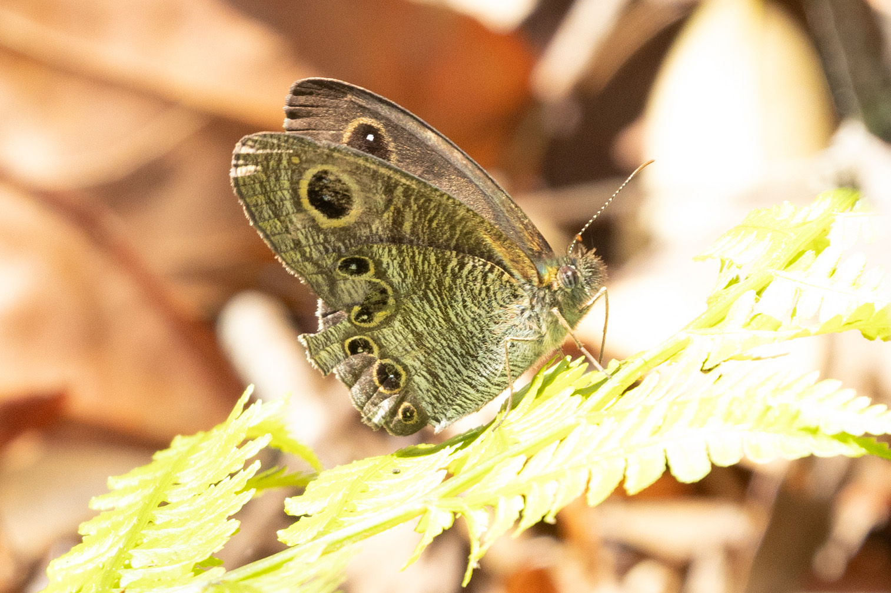
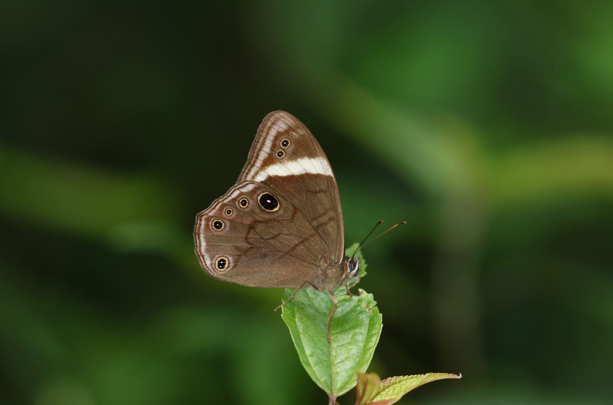

I made a brief stop at the visitors centre before continuing on the trail. I did the Green -> Yellow -> Pink -> Orange -> Black trails before returning to the visitors centre. The trail went up to about 1700m ASL. It was very quiet, with some birds but nary a butterfly. Around 1pm, I had to head back to the visitors center for lunch to catch the return bus (Last bus departs at 3.30pm I think). On the way, two Scarce Lilacforks (*Lethe dura*) were puddling near the floor but instantly shot into the canopy upon sensing me. Lunch was once again some braised thing (260NTD). The walk down was slightly better, with a Six-bar Swordtail (*Graphium eurous*) and an ovipositing Yellow Coster (*Acraea issoria*) near a patch of Bidens. The Swordtail was not very cooperative and I only ended up with record shots. The bus ride back was an uneventful three hours. I did not manage to see my main target, *Horaga rarasana* but it is supposed to be an early summer species. しょうがない.

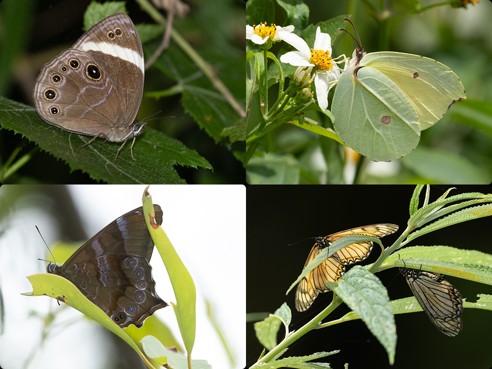

#### Day 3 Dongyanshan -  Manyueyuan 
Weather: Partly cloudy but the skies got dark around noon for about two hours.

```{r echo=FALSE} 
dispal <- colorFactor("Spectral", domain = df_merge$Day, na.color = "black") # TO fix grouping

leaflet() %>%
  addTiles() %>%
  addPolylines(data=df3, lat = ~lat, lng = ~lon, opacity=1, weight = 3, group = "Day 3", 
               color='#d1615d') %>%
  addLegend(position = "bottomright", colors=c( '#d1615d'), labels =c( "Day 3"),
          title = "Day",
          opacity = 1)%>%
  addLayersControl(
    overlayGroups = c("Day 3"),
    options = layersControlOptions(collapsed = FALSE)) 


#{r, echo=FALSE,out.width="49%", 
# out.height="20%",fig.cap="caption",fig.show='hold',fig.align='center'}
# knitr::include_graphics(c("path/to/img1","path/to/img1")) #To have multiple pics in a line
```

After a not very successful previous day, I decided I had enough of mountains and headed to Dongyanshan. The trip there took two hours in total, with a change of bus at Daxi. I ended up catching the second bus with three minutes to spare.


I arrived at the Dongyanshan entrance (~900m ASL) at 9am. Since I wanted to exit through Manyueyuan, I did the Geology Trail that leads to the Dongman trailhead. Not much time was spent in Dongyanshan itself. The Geology Trail is a rather flat gravel path through the park. One side is flanked by Bidens which attracted some butterflies. *Junonia iphita*, *Pieris sp* and *Ypthima spp* were commonly seen nectaring on the flowers. Highlights for this section were the Formosan Punch (*Dodona formosana*) and a puddling Powdered Oakblue (*Arhopala bazalus*).


I decided to do the 7.6km Dongman trail which connects Dongyanshan and Manyueyuan National Forest Recreation Area. From the trailhead at 950m ASL, the trail goes up to 1100m before descending to 600m. There were a lot of stairs, especially towards the Manyueyuan side but otherwise it was not a difficult trail. The main butterflies along the trail were the Orange Oakleaf, *Ypthimas spp.* and *Mycalesis spp.*. Around noon, the sky turned dark and there was almost no activity. Fortunately, it became more sunny around 1pm and some butterflies were spotted along the way. I managed a record shot of the Sergeant Major (*Abrota ganga*) sunbathing in a sunlit patch. A few *Arhopalas* and an endemic cf. *Celaenorrhinus horishanus* were seen along the way down to Manyueyan. 

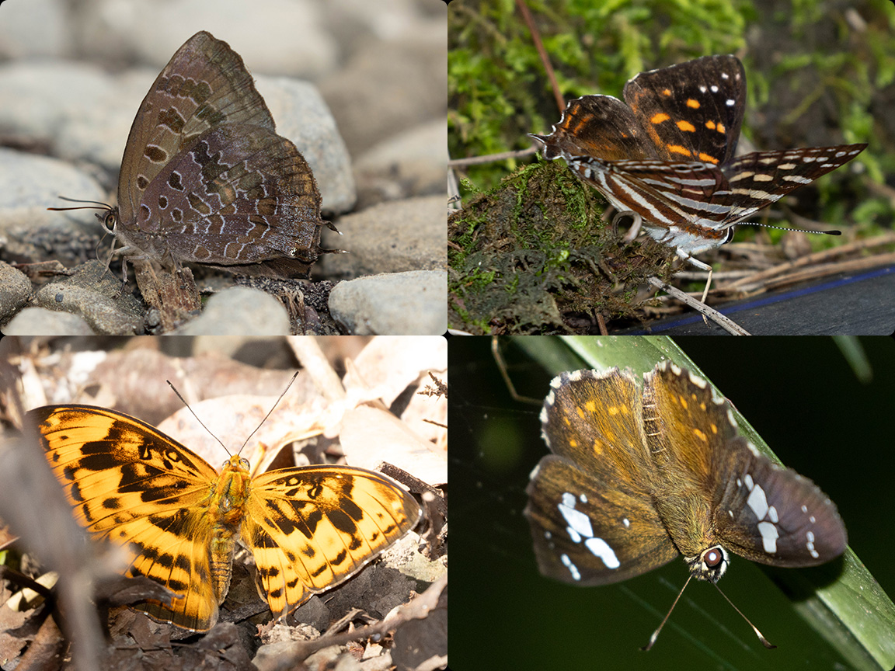

By the time I finished the trail, it was already 2pm. Since the foodstand within the park only  had snacks and light food, I headed out of the park for mushroom noodles and beancurd. It was too rushed to catch the 3.45pm bus and I had to wait for the 6.10pm bus. The surroundings had a small trail along a creek. There were not any rarities but at least I got the pretty Shiny Spotted Bob (*Isoteinon lamprospilus*). By 5pm, the light was starting to fade and activity had died down. I ended up waiting at the busstop for an hour. I arrived back in Taoyuan at 7.45pm. After a quick dinner (beef noodles + cabbage) a the stall under the hotel, I caught the train to Taipei.

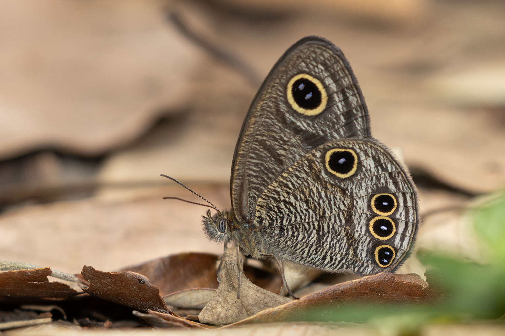

For Taipei, I decided to continue splurging a little on accommodations. I stayed at Hon Chou Hotel at Ximending (~$55/Night). The room was tiny, with only about 1.5m from the edge of the bed to the toilet but was otherwise fine.

### Taipei (9th-10th May)
#### Yangmingshan, Pingding ancient canal (~400m ASL)
Weather: Mostly clear, very windy

```{r echo=FALSE} 
dispal <- colorFactor("Spectral", domain = df_merge$Day, na.color = "black") # TO fix grouping

leaflet() %>%
  addTiles() %>%
  addPolylines(data=df4, lat = ~lat, lng = ~lon, opacity=1, weight = 3, group = "Day 4", 
               color='#5778a4') %>%
  addLegend(position = "bottomright", colors=c('#5778a4'), labels =c("Day 4"),
          title = "Day",
          opacity = 1)%>%
  addLayersControl(
    overlayGroups = c("Day 4"),
    options = layersControlOptions(collapsed = FALSE)) 


#{r, echo=FALSE,out.width="49%", 
# out.height="20%",fig.cap="caption",fig.show='hold',fig.align='center'}
# knitr::include_graphics(c("path/to/img1","path/to/img1")) #To have multiple pics in a line
```

After the previous day, I felt I needed a little more rest and woke up a little later. After breakfast (some fish crepe thing), I caught the bus to Jiantan station. The bus was supposed to be >10 mins early to change to the Pingding bus but I ended up missing the latter bus. Since the next bus was in an hour, I decided to  take a taxi there (-450NTD) and reached Pingding ancient canal at 10.20am. I started the trail by Walking along the top canal. There were some butterflies including a *Chitoria chrysolora* that perched high a few times. Yellow jesters (*Symbrenthia brabira*) were also rather common along the trail. Along the main trail, a bridge over the stream was decently productive, with a Five Dot Sergeant (*Limenitis sulpitia*) and an Angled Sunbeam. A few more common butterflies could be seen puddling along the banks. After crossing the bridge, realised I was taking taking the path away from the planned lunch spot and turned back the other path. However, the cafe was closed that day and the coffeeshop only had coffee. On the way back to the trail, I spotted a Red Ring Skirt (*Hestina assimilis*) puddling on a banana leaf and an endemic, tattered *Penthema formosanum* sunbathing. The Red Ring Skirt is not rare but it is quite a pretty butt! The *Penthema* was not cooperative and I could only get bottom-up shots of it sunbathing. I decided to take another path out to a different part of the park which was uneventful. But right at the end of the trail, an Orange Awlet (*Burara jaina*) and a White Commodore (*Parasarpa dudu*) were spotted along the road. 

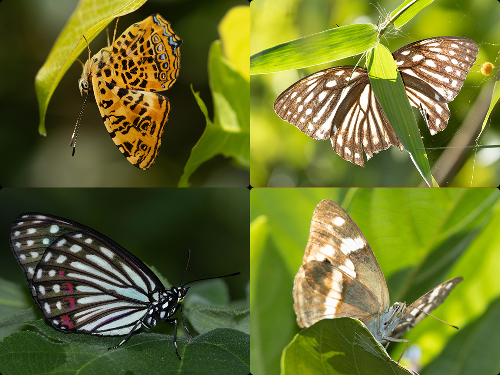

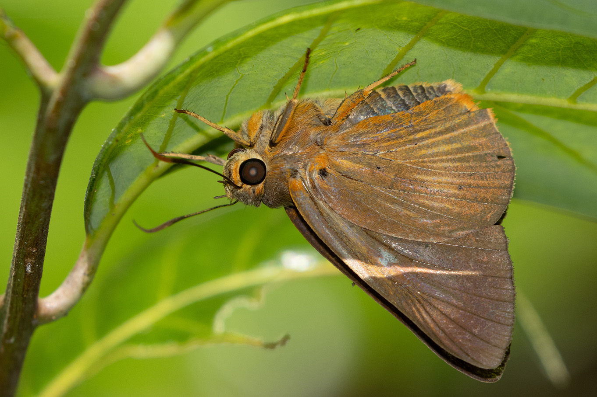

Due to some event at a temple, the bus was not stopping at the terminus and I had to walk down to the next stop. As I had 19 mins before the bus arrived, I went to check out the nearby Shengren waterfall. A pair of Blue Admirals were  dogfighting and sunbathing at the entrance but did not stay for pictures. A bonus was a friendly Red ring skirt  resting and getting blown around in the wind. I caught the bus back to Taipei and had my dunch (dumplings) at 4.30pm. At Z's insistence, I checked out the Ximending night market near the hotel. It's alright, no butterflies were spotted there.


#### Jiannan and Fuzhoushan 
Weather: 晴れ

```{r echo=FALSE} 
dispal <- colorFactor("Spectral", domain = df_merge$Day, na.color = "black") # TO fix grouping

leaflet() %>%
  addTiles() %>%
  addPolylines(data=df5, lat = ~lat, lng = ~lon, opacity=1, weight = 3, group = "Day 5", 
               color='#e49444') %>%

  addLegend(position = "bottomright", colors=c('#e49444'), labels =c("Day 5"),
          title = "Day",
          opacity = 1)%>%
  addLayersControl(
    overlayGroups = c("Day 5"),
    options = layersControlOptions(collapsed = FALSE)) 


#{r, echo=FALSE,out.width="49%", 
# out.height="20%",fig.cap="caption",fig.show='hold',fig.align='center'}
# knitr::include_graphics(c("path/to/img1","path/to/img1")) #To have multiple pics in a line
```

Last day in Taiwan and I overslept a little again. After a breakfast of leftover guava (probably the best night market food), I set out to the Jiannan Butterfly Garden. At last it was a sunny day in Taiwan. The trip took 30 minutes and I arrived at 8.45am. This place was recommended by Z and I had high hopes for it. The base of the hill was a bit foresty, but the top was planted with host plants, similar to a small butterfly hill. The start had typical butterflies like the Mapwings and *Neptis sp.*. I finally got the Common Palmfly here, the first in this trip! One of the bushes at the top attracted a lot of Dwarf Crows and a tiger but the area was otherwise quiet. I walked around the hill but after 2 hours with nothing other than a flying orange tip, I decided to change locations. The walk down was more eventful with a Quaker and a Dark Caerulean. 


For the second half of the day, I went to Fuyang Ecopark. The owner of a store I patronised the previous day  mentioned the hill and it seemed somewhat promising on iNat. The two locations are only a 30 minute MRT ride apart on the brown line. Lunch was chicken chop rice from a store next to the MRT.

Not even 100m from the start of the trail was one of my targets, the endemic *Satyrium formosana* resting on an aroid! It was very pristine and confiding. This turned out to be the only time this trip I used my macro lens. The Regrown Woods area was decent as well, with *Arhopalas* and a Beautiful Leopard among others. When I headed back to the entrance to use the toilet, I spotted another *S. formosana*. I initially thought it to be the same individual but the first one was still on the same leaf. It seems to be not uncommon in the correct season. After exploring Fuyang Ecopark, I decided to do the short (300m) hike to the adjacent Fuzhoushan. Fuzhoushan was quiet but I finally managed to get a shot of the Great Orange Tip in this trip. 

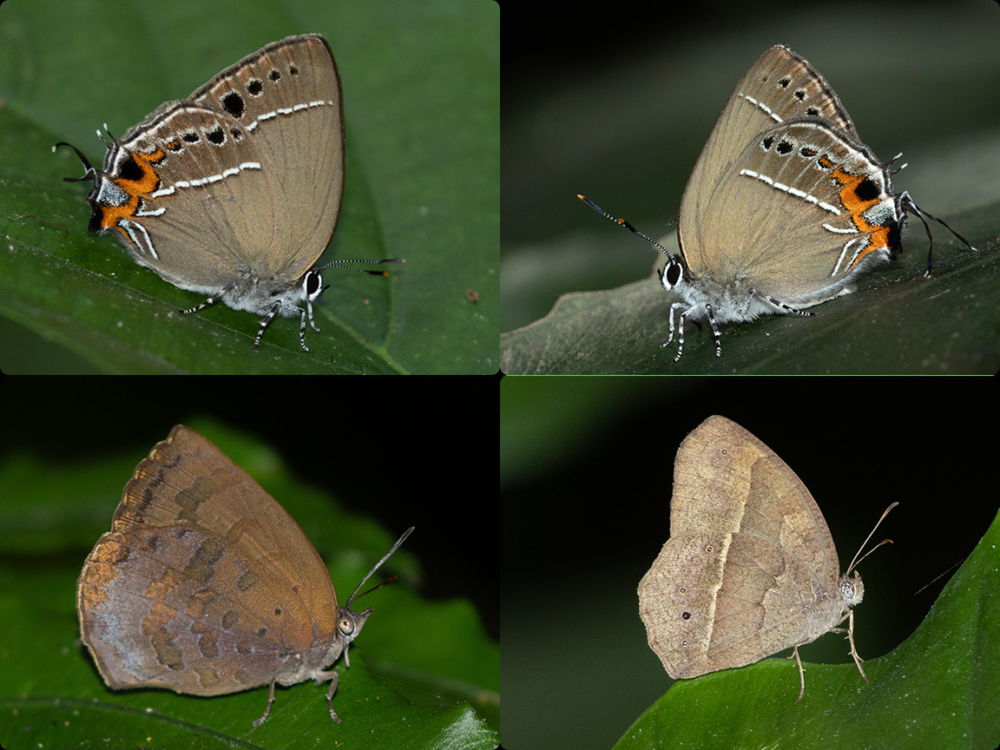

As it was getting quiet and there wasn't time for another location, I headed back to Ximending to grab my bags and made my way to the airport. Dinner was Japanese curry at some mall next to the train station. I took the 9pm train to the airport for my 1am flight back to Singapore. The airport has free showers so that was nice. 

### Overall
Taiwan was really easy to get around with convenient public transport even to the mountainous areas. The original plan was to rent a bike (even got my IDP) but I wasn't feeling too good on the first few days so I decided to take the bus. That made it difficult to visit same potential sites along the way. 

Butterfly abundance and diversity was more disappointing this trip with only about 70 species over the five days and many of the species were only seen once to twice. The diversity of Papilionids and Lycaenids seen were lower than expected.

#### Other stuff & Cost breakdown    
List of stuff I brought for the trip
Gear:\
- Canon R7\
- Sigma 150mm f2.8 macro (Only used this for the Satyrium)\
- Canon 100-400 f/4.5-5.6L II\
- Canon Speedlite 600EX & 430EXII\
- Garmin GPSMAP 65s\


#### Breakdown of expenditure for this trip:

```{r echo=FALSE,}
CostDF <- read.csv("Supporting/TW2024.csv", header= T,sep = ",")[1:7,]
CostDF[is.na(CostDF)] <- ""
CostDF2 <- setNames(CostDF, c("Date","Flight (SGD)", "Accommodations (SGD)",
                              "Transport", "Breakfast","Lunch", "Dinner",
                              "Entrance Fee", "Other"))

CostDF2 %>%
  kbl(align="c") %>%
  kable_paper(c("hover")) %>%
  footnote(general="Other than Flight and Accomodations, values in NTD")
```

Overall, the trip was quite affordable, with about $200 spent on necessities in Taiwan over the five days. The flights were surprisingly cheap as well. I guess I will have to return for more of the endemics sometime.
