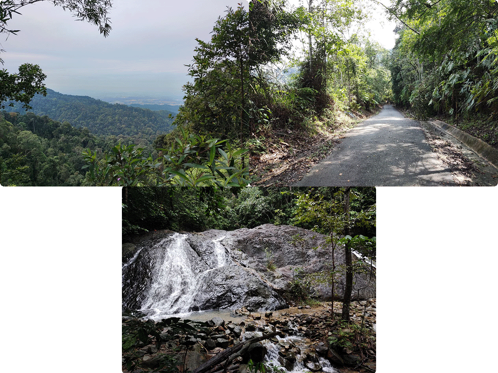
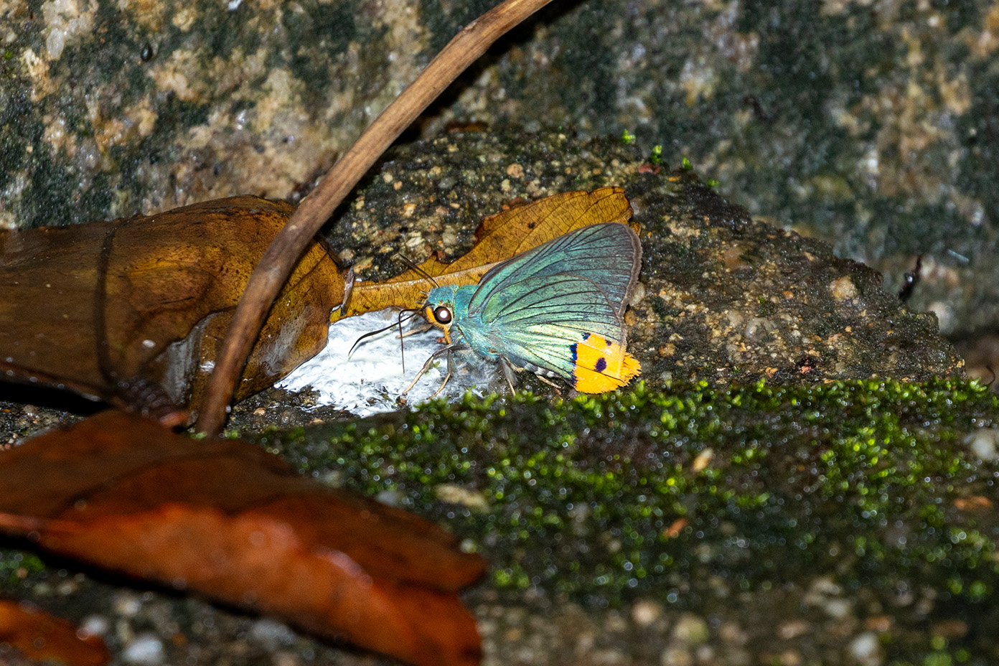
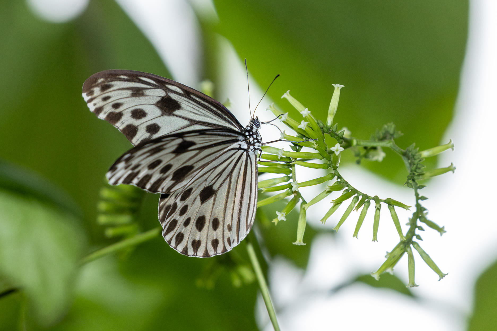
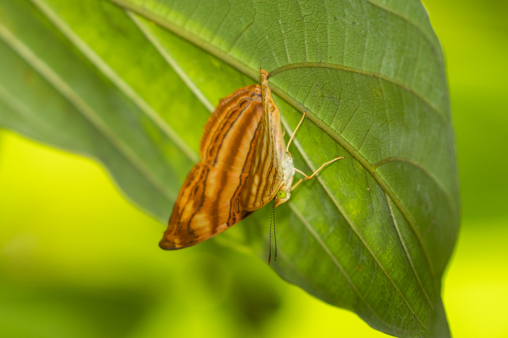

```{r setup, include=FALSE}
knitr::opts_chunk$set(echo = TRUE)
library(XML)
library(leaflet)
library(here)
library(tidyverse)
library("kableExtra")
```


```{r echo=FALSE, results='hide',fig.show='hide'} 
#Chunk to use GPS data for the days. Convert .log to .gpx first
#hike
gpx_parsed1 <- htmlTreeParse(file = "GPS/Pulai.gpx", useInternalNodes = TRUE)
coords1 <- xpathSApply(doc = gpx_parsed1, path = "//trkpt", fun = xmlAttrs)
elevation1 <- xpathSApply(doc = gpx_parsed1, path = "//trkpt/ele", fun = xmlValue)

df1 <- data.frame(
  lat = as.numeric(coords1["lat", ]),
  lon = as.numeric(coords1["lon", ]),
  elevation = as.numeric(elevation1)
)

#drive
gpx_parsed2 <- htmlTreeParse(file = "GPS/drive.gpx", useInternalNodes = TRUE)
coords2 <- xpathSApply(doc = gpx_parsed2, path = "//trkpt", fun = xmlAttrs)
elevation2 <- xpathSApply(doc = gpx_parsed2, path = "//trkpt/ele", fun = xmlValue)

df2 <- data.frame(
  lat = as.numeric(coords2["lat", ]),
  lon = as.numeric(coords2["lon", ]),
  elevation = as.numeric(elevation2)
)


df1 <- df1 %>%
  add_column(Day = "1")
df2 <- df2 %>%
  add_column(Day = "2")


df_merge<-bind_rows(df1,df2)

#echo=FALSE, results='hide',fig.show='hide' to hide code, results and plot respectively
```

## trip report

###  Overview

Gunung Pulai is a small hill (~600m) in the south of Johor. It is an hour's drive from the Second Link, making it quite a convenient day-trip from Singapore. It is quite like a taller Bukit Timah and seems like a popular destination for locals as well. This was my second trip to this location; My first trip did not have anything special other than the Smaller Wood Nymphs (*Ideopsis gaura*) which I initially thought were Tree Nymphs. 



For this casual trip, I tagged along with my family who wanted to climb this hill for fun. Hence I did not really have much time to stop and wait for butterflies. There is also a trail through the forest but I have never done that one. 

### Gunung Pulai Trip
Weather: Slightly overcast in the morning, sunny in the afternoon\ 

```{r echo=FALSE} 
dispal <- colorFactor("Spectral", domain = df_merge$Day, na.color = "black") # TO fix grouping

leaflet() %>%
  addTiles() %>%
  addPolylines(data=df2, lat = ~lat, lng = ~lon, opacity=1, weight = 3, group = "Day 1", 
               color='black') %>%
  addLegend(position = "bottomright", colors=c('black'), labels =c("Drive"),
          title = "Drive",
          opacity = 1)%>%
  addLayersControl(
    overlayGroups = c("Drive"),
    options = layersControlOptions(collapsed = FALSE)) 

#{r, echo=FALSE,out.width="49%", 
# out.height="20%",fig.cap="caption",fig.show='hold',fig.align='center'}
# knitr::include_graphics(c("path/to/img1","path/to/img1")) #To have multiple pics in a line
```

We set off at 6.20am towards Gunung Pulai via the Tuas Second Link. Traffic was smooth at that hour and we arrived at the entrance at around 8am (entrance and parking costs 4RM). It had rained very heavily the night before and the sky was still overcast when we begun the hike. Do note that the park entrance (~70m ASL) had a rather thorough check for plastics.

```{r echo=FALSE} 
dispal <- colorFactor("Spectral", domain = df_merge$Day, na.color = "black") # TO fix grouping

leaflet() %>%
  addTiles() %>%
  addPolylines(data=df1, lat = ~lat, lng = ~lon, opacity=1, weight = 3, group = "Day 1", 
               color='#5778a4') %>%
  addMarkers(lat = 1.591995, lng = 103.534579,
             label = "Choaspes")%>%
  addLegend(position = "bottomright", colors=c('#5778a4'), labels =c("Hike"),
          title = "Hike",
          opacity = 1)%>%
  addLayersControl(
    overlayGroups = c("Hike"),
    options = layersControlOptions(collapsed = FALSE)) 

#{r, echo=FALSE,out.width="49%", 
# out.height="20%",fig.cap="caption",fig.show='hold',fig.align='center'}
# knitr::include_graphics(c("path/to/img1","path/to/img1")) #To have multiple pics in a line
```
^Hover over the marker to see what was spotted there^


It was very quiet at the start, without much activity other than a Common Awl until around 40 minutes into the hike, I saw shiny blue butterfly with a spot of yellow dart out of the surrounding vegetation and puddle along the side of the drains. I tried to chase it but it was very skittish and did not stay at any spot for long. Fortunately, it remained at some bird droppings for a few seconds, enough for some record shots from afar. That confirmed my suspicions, an Awlking (*Choaspes sp.*), probably *Choaspes stigmata*!



The rest of the way up to the summit was uneventful. The actual peak is occupied by a protected area so you cannot summit it but there is a viewing area right before the summit. On the climb up, the weather had progressively cleared up and it was quite sunny when we had finished reached the top. A couple of Smaller Wood Nymphs and Crows were spotting feeding there.



After a short break, we made our way down which was more happening. The typical forest butterflies such as Yeomans, Barons and Archdukes could once again be spotted. A flowering tree near the Awlking spot was fruitful with an Intermediate Maplet (*Chersonesia intermedia*), Pyroneura sp. (might be *latoia*), Banded Yeoman, and a mystery blue that I did not manage to get a shot of. 



We continued down and back at the toilet, a Redspot Duke (*Dophla evelina*) was spotted resting on a tree. There is a short trail around the waterfalls but we did not really walk there on this trip. The total time spent was about 4.5 hours. After the hike, we headed to Bukit Indah for lunch (not pictured).


#### Other stuff & Cost breakdown    

List of stuff I brought for the trip\   
Gear:\
- Canon R7\
- Canon 100-400 f/4.5-5.6L II\
- Canon Speedlite 600EX\
- Garmin GPSMAP 65s\
