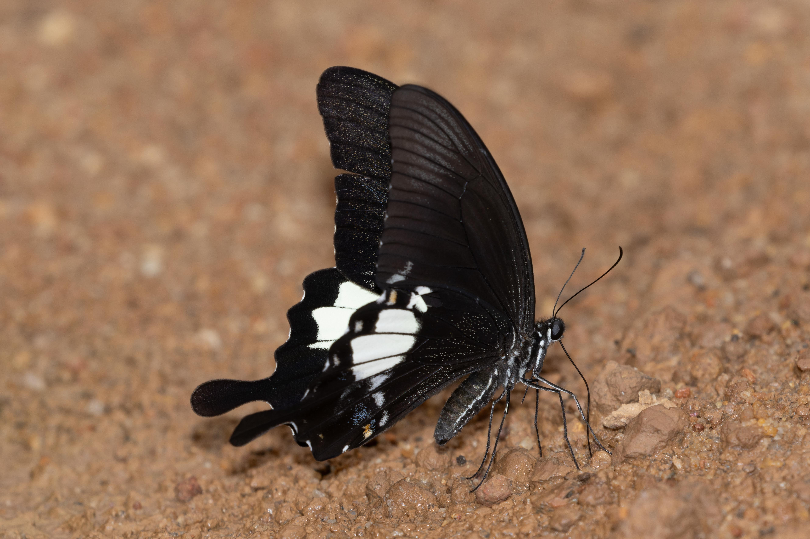

```{r setup, include=FALSE}
knitr::opts_chunk$set(echo = TRUE)
library(XML)
library(leaflet)
library(here)
library(tidyverse)
library("kableExtra")
```

```{r echo=FALSE, results='hide',fig.show='hide'} 
#Chunk to use GPS data for the days. Convert .log to .gpx first
#hike
gpx_parsed1 <- htmlTreeParse(file = "GPS/panti.gpx", useInternalNodes = TRUE)
coords1 <- xpathSApply(doc = gpx_parsed1, path = "//trkpt", fun = xmlAttrs)
elevation1 <- xpathSApply(doc = gpx_parsed1, path = "//trkpt/ele", fun = xmlValue)

df1 <- data.frame(
  lat = as.numeric(coords1["lat", ]),
  lon = as.numeric(coords1["lon", ]),
  elevation = as.numeric(elevation1)
)


df1 <- df1 %>%
  add_column(Day = "1")

df_merge<-bind_rows(df1)

#echo=FALSE, results='hide',fig.show='hide' to hide code, results and plot respectively
```

## Panti trip report

###  Brief Introduction

On 2nd July 2024, we headed to Panti Forest in Southern Johor for a butterfly day trip. It is located near Kota Tinggi, about an hour's drive from the causeway. Panti Bunker Trail is quite a popular wildlife site and I had gone there once before for birding. It is not very accessible so you will need your own transport to get around the different sites.

Additional info: Permits are required for Panti :).

### Panti Forest Trip
Weather: Semi-cloudy with periods of sun\ 
Party members: Z, JK, C\  

Since C was driving, the rest of us met at 8am at Kranji MRT. It was still drizzling from the night's rain but we decided to continue on with the trip. We cleared the customs quite quickly and from there it was a one hour drive to Panti. The sky had slightly cleared up on the way so we were a little more hopeful.

```{r echo=FALSE} 
dispal <- colorFactor("Spectral", domain = df_merge$Day, na.color = "black") # TO fix grouping

leaflet() %>%
  addTiles() %>%
  addPolylines(data=df1, lat = ~lat, lng = ~lon, opacity=1, weight = 3, group = "Day 1", 
               color='#5778a4') %>%
  fitBounds(lat1 = 1.8834, lng1 = 103.8694, 
            lat2 = 1.8655, lng2 = 103.9338)%>%
  addMarkers(lat = 1.876243, lng = 103.92504,
             label = "Panti Entrance")%>%
  addMarkers(lat = 1.86070, lng = 103.88987,
             label = "Temple Trail")%>%
  addMarkers(lat = 1.87110, lng = 103.87416,
             label = "First Trail")%>%
  addLegend(position = "bottomright", colors=c('#5778a4'), labels =c("Day 1"),
          title = "Day 1",
          opacity = 1)%>%
  addLayersControl(
    overlayGroups = c("Day 1"),
    options = layersControlOptions(collapsed = FALSE)) 

#{r, echo=FALSE,out.width="49%", 
# out.height="20%",fig.cap="caption",fig.show='hold',fig.align='center'}
# knitr::include_graphics(c("path/to/img1","path/to/img1")) #To have multiple pics in a line
```

Upon reaching Panti proper at 9.45am, the first butterfly of the day was the Common Wanderer (*Pareronia valeria*), a lifer for me. I had previously seen the Dark Wanderer in Sri Lanka and probably the common in Taman Negara a few years back but I did not manage any record shots then. 

======

=========

We stopped at multiple points along the main road to look for butterflies and Odonates but these were mainly the typical Euremas and such. We arrived at the first trailhead at just before 11am. Z went to work to attract  butterflies while the rest of us checked out the area. There were three or four Clippers (*Parthenos sylvia*) flying around a bush with some other roadside butterflies. A Common Nawab had immediately responded to Z and we headed over to snap some photographs of it. 

We soon decided to head into the trail to the Arhopala spot where they had previously seen many Arhoapalas. Not far into the trail C spotted a Yellow-bodied Clubtail (*Losaria neptunis*) resting low! This species has always been on my wishlist due to its strange patterns. A lot of shouting ensued as Z was still gallivanting along the main road. Unfortunately, it took off soon after he got there. 


Further down, we explored a small opening in the forest. A few Malayan Assyrians and Royal Assyrians. Missed a Catseye. As we continued along the trail, Terinos were rather common, sunbathing. 


We soon arrived at the Arhopala spot. It was a shady area with knee-high vegetation. Other than a few attractive *Leucauge sarawakensis*? spiders, the spot turned out to be rather quiet that day. After some time of fruitless searching we decided to head back and check out the other trails in Panti. I managed to spot a few other species on the way out. These included a Harlequin (*Taxila haquinus*) and a Malay Punchinello (*Zemeros emesoides*). At the main road, the typical species were puddling along the sides. The highlight was a friendly Blue Helen (*Papilio prexaspes*). It was not a lifer for me but I have only seen this species once at BTNR when I was just starting out. 





The second trail we went to was Temple Trail (~1km). We arrived at the trailhead at 2pm and stayed for about an hour. Overall, it was very quiet with just a Sky Blue (*Jamides caeruleus*) and a Banded Angle (*Odontoptilum pygela*). By 3 pm, the sky had turned quite dark and we decided to head back. 

It was not the most exciting day but the *Losaria neptunus* was nice. I had previously seen *L. doubledayi* at Taman Negara. Hoping to see a Graphium empedovana one day. Also still need the Large Assyrian. Lastly, thanks to everyone that organised the trip!

#### List of butterflies
The iNat list can be found [here](https://www.inaturalist.org/observations?on=2024-07-02&place_id=any&subview=table&taxon_id=47224&user_id=weishou&verifiable=any)!

#### Other stuff & Cost breakdown

List of stuff I brought for the trip\   
Gear:\
- Canon R7\
- Canon 100-400 f/4.5-5.6L II\
- Sigma 150mm f/2.8 macro (unused)\
- Canon Speedlite 600EX\
- Garmin GPSMAP 65s\