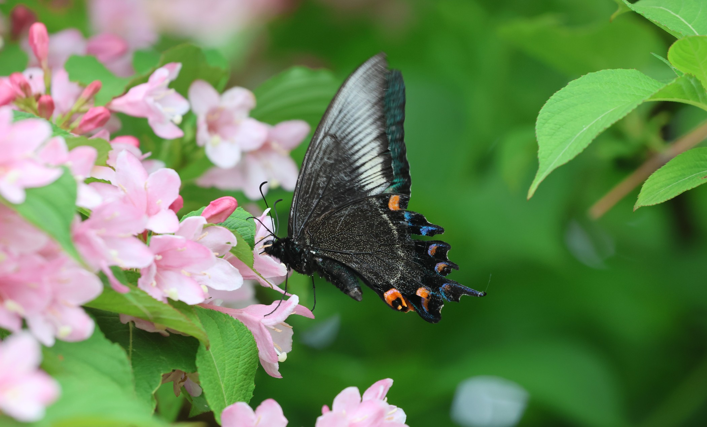
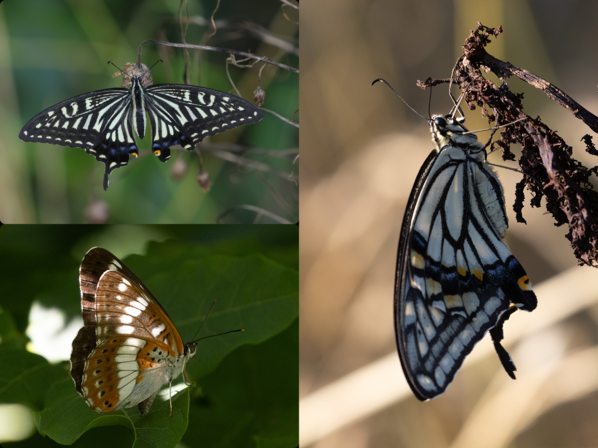
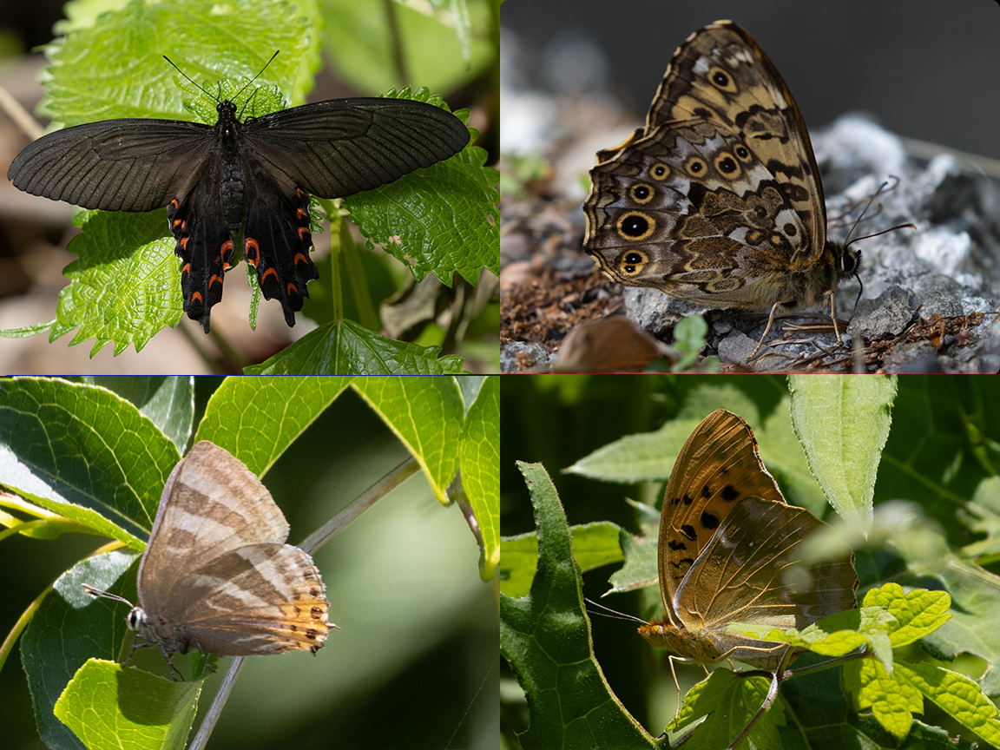
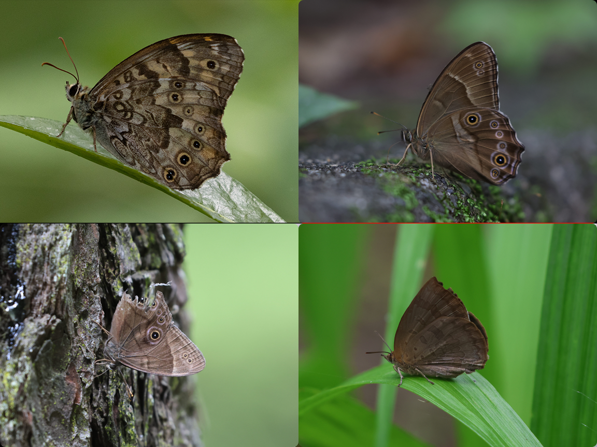

```{r, include=FALSE, eval=FALSE}
library(distill)
create_post("Title")
#then copy the top lines over
```

```{r setup, include=FALSE}
knitr::opts_chunk$set(echo = TRUE)
library(XML)
library(leaflet)
library(here)
library(tidyverse)
library("kableExtra")
```

```{r echo=FALSE, results='hide',fig.show='hide'} 
#Chunk to use GPS data for the days. Convert .log to .gpx first #TO CHANGE LATER
#Yakushima
gpx_parsed1 <- htmlTreeParse(file = "GPS/Yaku.gpx", useInternalNodes = TRUE)
coords1 <- xpathSApply(doc = gpx_parsed1, path = "//trkpt", fun = xmlAttrs)
elevation1 <- xpathSApply(doc = gpx_parsed1, path = "//trkpt/ele", fun = xmlValue)

df1 <- data.frame(
  lat = as.numeric(coords1["lat", ]),
  lon = as.numeric(coords1["lon", ]),
  elevation = as.numeric(elevation1)
)

#Takasaki
gpx_parsed2 <- htmlTreeParse(file = "GPS/Jpn_2025_1.gpx", useInternalNodes = TRUE)
coords2 <- xpathSApply(doc = gpx_parsed2, path = "//trkpt", fun = xmlAttrs)
elevation2 <- xpathSApply(doc = gpx_parsed2, path = "//trkpt/ele", fun = xmlValue)

df2 <- data.frame(
  lat = as.numeric(coords2["lat", ]),
  lon = as.numeric(coords2["lon", ]),
  elevation = as.numeric(elevation2)
)

#Oze
gpx_parsed3 <- htmlTreeParse(file = "GPS/Jpn_2025_2.gpx", useInternalNodes = TRUE)
coords3 <- xpathSApply(doc = gpx_parsed3, path = "//trkpt", fun = xmlAttrs)
elevation3 <- xpathSApply(doc = gpx_parsed3, path = "//trkpt/ele", fun = xmlValue)

df3 <- data.frame(
  lat = as.numeric(coords3["lat", ]),
  lon = as.numeric(coords3["lon", ]),
  elevation = as.numeric(elevation3)
)

#Mt Haruna
gpx_parsed4 <- htmlTreeParse(file = "GPS/Jpn_2025_3.gpx", useInternalNodes = TRUE)
coords4 <- xpathSApply(doc = gpx_parsed4, path = "//trkpt", fun = xmlAttrs)
elevation4 <- xpathSApply(doc = gpx_parsed4, path = "//trkpt/ele", fun = xmlValue)

df4 <- data.frame(
  lat = as.numeric(coords4["lat", ]),
  lon = as.numeric(coords4["lon", ]),
  elevation = as.numeric(elevation4)
)

#Gunma no mori
gpx_parsed5 <- htmlTreeParse(file = "GPS/Jpn_2025_4.gpx", useInternalNodes = TRUE)
coords5 <- xpathSApply(doc = gpx_parsed5, path = "//trkpt", fun = xmlAttrs)
elevation5 <- xpathSApply(doc = gpx_parsed5, path = "//trkpt/ele", fun = xmlValue)

df5 <- data.frame(
  lat = as.numeric(coords5["lat", ]),
  lon = as.numeric(coords5["lon", ]),
  elevation = as.numeric(elevation5)
)


#df1 <- df1 %>%
#  add_column(Day = "1")
#df2 <- df2 %>%
#  add_column(Day = "2")
#df3 <- df3 %>%
#  add_column(Day = "3")
#df4 <- df4 %>%
#  add_column(Day = "4")
#df5 <- df5 %>%
#  add_column(Day = "5")

#df_merge<-bind_rows(df1,df2,df3,df4,df5)

#echo=FALSE, results='hide',fig.show='hide' to hide code, results and plot respectively
```


## Japan 2025 

###  Overview

In terms of species, Japan is not particularly diverse, with only approximately 320 species in total over the entire archipelago. My previous trips there had been unsuccessful due to the timing and weather. This post is a summary of my two trips, one with my family to Kyushu in April 2025, and the second was a solo trip to Tokyo and Gunma Preferectures (June 2025). With Kyushu being in the southern part of Japan, I had hoped that the butterfly season would begin earlier. There are a few specialties in the Kyushu region such as the Large Shijimimi Blue (*Shijimiaeoides divina*) that I hoped to see. Overall, the weather was bad in the first few days and I did not get any butterflies until I got to Kagoshima Prefecture. The main opportunity I had to butterfly was about a half hour window while the others were drinking tea in a tea plantation in Yakushima.

For the second trip, it was a rather impulsive trip since I had some time (booked the tickets about 2 weeks ahead). The weather looked good for butterflying at the start but the second half was just a constant drizzle and rain. This gave me about 3-4 days of decent butterflying in Gunma while I spent my time exploring the Tokyo instead of going to the nearby mountains. I couldn't find much information regarding the butterflies in Gunma on INat so this was a rather exploratory trip. 

### Kyushu 
#### Yakushima (23 April 2025)
Weather: Rather cloudy   
I did not have much time to butterfly during the Kyushu 2025 trip due to the weather and low activity other than some time at Yakushima. There was a morning at Manamiosumi with strong sunshine but the only thing I spotted outside the accommodations were pale grass blues. The main chance I had was a visit to the Hachimanju Tea Shop in Yakushima. I had about 45 mins to explore the area while my family drank tea in the plantation. It was semi residential so there were some flowers to attract butterflies. The only notable one for me was an Alpine Black Swallowtail (*Papilio mackii*). We spent the rest of the day exploring the rest of the island.



### Kanto 2025 (5th - 12th June 2025)
#### Day 1 Arrival and Takasaki
Weather: Sunny
After my Japanese mid-term test, I headed directly to the airport to catch the 0030 flight to Narita Airport via Zipair. I was given last row seats which let me stretch my legs off to the side but I couldn't recline... The plane arrived on time, and after clearing immigration, I headed to the purchase the bus ticket to Takasaki (5300円). Going by train might be faster or cheaper but you would have to do multiple transfers. The trip took about 3 hours, including a rest stop at a service area and I arrived at 1300. Outside was a nice, cool 30 degrees. I dropped my bags off at my accommodations (Karasuya Guesthouse, ~$40/night) before having lunch at a nearby Katsudon place. It ended up being my cheapest meal at 600円. The hostel was overall quite comfortable and the staff were nice. 

For the rest of the day, I slowly made my way towards the Shorinzan Daruma Temple. It is only about 5km as the crow flies but i spent the next 3-4 hours slowly following the Karasu and Unsui Rivers. The habitat is mostly low riparian vegetation near the river and baseball fields on the other side. The diversity here was not high mostly comprised of whites and commas. Occasionally, Small Coppers (*Lycaena phlaeas*) and Short-tailed Blues (*Cupido argiades*) were spotted feeding or puddling. An unused area near the Takasaki City Notsuke Green Space was surprisingly rather productive with a Goschkevitschi's Labyrinth (*Neope goschkevitschii*) and an endemic Honshu White Admiral (*Limenitis glorifica*)among other butterflies. I eventually reached the temple but it was too late to make a daruma. By then it was already quite late and I decided to head back. I spotted a confiding Asian Swallowtail (*Papilio xuthus*) resting on some long grasses outside the temple and finally managed to get camera shots of this species. While a common species, the previous times I had been unprepared (OTW to an onsen etc). That was the last butterfly of the day and headed back to the station for dinner and get some rest. 



```{r echo=FALSE} 
#dispal <- colorFactor("Spectral", domain = df_merge$Day, na.color = "black") # TO fix grouping

leaflet() %>%
  addTiles() %>%
  addPolylines(data=df2, lat = ~lat, lng = ~lon, opacity=1, weight = 3, #group = "Day 3", 
               color='#d1615d') %>%
  addLegend(position = "bottomright", colors=c( '#d1615d'), labels =c( "Around Takasaki"),
          title = "Site",
          opacity = 1)
#%>%
#  addLayersControl(
#    overlayGroups = c("Day 3"),
#    options = layersControlOptions(collapsed = FALSE)) 


#{r, echo=FALSE,out.width="49%", 
# out.height="20%",fig.cap="caption",fig.show='hold',fig.align='center'}
# knitr::include_graphics(c("path/to/img1","path/to/img1")) #To have multiple pics in a line
```

#### Day 2 Oze National Park (~1300-1400m ASL)
Weather: Cloudy

```{r echo=FALSE} 
#dispal <- colorFactor("Spectral", domain = df_merge$Day, na.color = "black") # TO fix grouping

leaflet() %>%
  addTiles() %>%
  addPolylines(data=df3, lat = ~lat, lng = ~lon, opacity=1, weight = 3, #group = "Day 3", 
               color='#d1615d') %>%
  setView(lng = 139.2, lat = 36.89, zoom = 12) %>%
  addLegend(position = "bottomright", colors=c( '#d1615d'), labels =c( "Oze National Park"),
          title = "Site",
          opacity = 1)
#%>%
#  addLayersControl(
#    overlayGroups = c("Day 3"),
#    options = layersControlOptions(collapsed = FALSE)) 


#{r, echo=FALSE,out.width="49%", 
# out.height="20%",fig.cap="caption",fig.show='hold',fig.align='center'}
# knitr::include_graphics(c("path/to/img1","path/to/img1")) #To have multiple pics in a line
```

Oze National Park is about 75km Northeast of Takasaki and is known for the Asian Skunk Cabbage blooms in late May to mid June and other alpine wildflowers. I set from from the hostel at 0600 to catch the 0621 train to Numata. From there, I boarded the 0730 bus to Oze Tokura (arrived 0840). I'm still not sure how the transport works there but I think there is a shuttle bus (1300円) to the trailhead. I took the mini-van taxi (also 1300円) to the trailhead and started the hike towards the marshes (Ozegahara) at 0915.Suprisingly, there was still ice along the side of the trail at certain parts. The hike was not difficult, with altitude change only at the start of the trail. The rest was on a boardwalk. The toughest part of the hike was probably being trapped being other hikers with multiple bear bells. Not long into the hike, a Mourning Cloak (*Nymphalis antiopa*) landed on me. After a few shots, it disappeared back into the trail. 

The hike from the trailhead to the visitor centre at Ozegahara took about an hour in total. From the visitor centre, a trail leads to an enclosed (research?) nursery for the skunk cabbage while the other leads to the main marshlands. I did the nursery loop first, which took maybe 45 mins to an hour. It was a bit late in the season for the skunk cabbages but its still quite nice. After an early lunch, I headed to the main trail at Ozegahara. There were a few unidentified whites and *Colias sp.* that flitted around but did not really stop. The newts and landscape turned out to be the main highlight. As the last bus down was at 1630, I began making my way back to the trailhead and reached at 1600. The runner bean (花豆) softserve (600円) at the trailhead shop was really good and is highly recommended! Each way took me about 3 hours and $50, quite an expensive place to get to. 


#### Day 3 Mt Haruna (~700-1100m ASL)
Weather: Mostly sunny
The first bus from Takasaki to Mt Haruna departs at 0830, allowing me to sleep in a little. After a quick breakfast from the Family Mart opposite the hostel, I set off on the trip to Mt Haruna which takes about an hour. The bus meanders through the suburbs, before taking you up to the lake (~1100m ASL) but I opted to drop off at Haruna Shrine (~700m ASL) to visit the shrine first. 

```{r echo=FALSE} 
#dispal <- colorFactor("Spectral", domain = df_merge$Day, na.color = "black") # TO fix grouping

leaflet() %>%
  addTiles() %>%
  addPolylines(data=df4, lat = ~lat, lng = ~lon, opacity=1, weight = 3, #group = "Day 3", 
               color='#d1615d') %>%
  setView(lng = 138.847, lat = 36.456, zoom = 12) %>%
  addLegend(position = "bottomright", colors=c( '#d1615d'), labels =c( "Mt Haruna"),
          title = "Site",
          opacity = 1)
#%>%
#  addLayersControl(
#    overlayGroups = c("Mt Haruna"),
#    options = layersControlOptions(collapsed = FALSE)) 

# 36.45648303042415, 138.8477687864439

#{r, echo=FALSE,out.width="49%", 
# out.height="20%",fig.cap="caption",fig.show='hold',fig.align='center'}
# knitr::include_graphics(c("path/to/img1","path/to/img1")) #To have multiple pics in a line
```

I headed up towards the shrine's carpark and was immediately greeted by 3-4 Glacial Apollos (*Parnassius glacialis*) feeding around the plants. I ended up spending about an hour around the carpark, trying to get better shots of the Apollos. At the base of the carpark, I was greeted by a cf. Palearctic Fritillary  (*Argynnis anadyomene*) that got spooked by an Apollo and a Japanese Flash (*Rapala arata*), both lifers for me. More Apollos could be seen flying around in shade on the opposite side of the road. 


After grabbing a yakimanju from a store in front of the temple, I went into Haruna Shrine. The cedar-lined trail was nice but it was a pity the main shrine was under renovation. Along the way, I spotted a Large Map (*Araschnia burejana*), but I was unfortunately on my wide angle lens. It stayed a bit around one of the bridges but I did not have enough time to change lenses before it got spooked by the other visitors. 

From Haruna Shrine, there is a nature trail that leads up to the lake. At the start, beaks were common sighted as well as a *Vanessa sp.*. The rest of the trail was quiet and the many signs warning of bears in the area encouraged me to make a quick exit from that trail. I believe the trail extends quite a bit further into the mountain, with another exit near the lake. Instead, the exit I came out from was along the main road... I continued on, along the side on the road for the next 2km but it was quite dangerous with decently heavy traffic but the drivers are generally careful. Oh, Mt Haruna was also featured in Initial D. I managed to shoot another *Neope* puddling along the sides, which should be the endemic Japanese Labyrinth (*Neope niphonica*). [The Labyrinths were IDed using the keys on this site](https://yoda1.exblog.jp/16262490/). The male rock was another decent photo opportunity where the Apollos stopped to nectar on the flowers. The last butterfly highlight was a Long-tailed Spangle (*Papilio macilentus*) right before the lake. 



After lunch, there was not enough time to explore the trail leading to Mt Haruna's summit and I decided to walk around the prefectorial park instead. There were a few Apollos and Ypthimas but nothing special. I caught the last bus down towards Takasaki at 1630. Dinner for the day was pasta, a Takasaki specialty and packed back the complimentary pizza slices. The pasta was good but a little strange as the sauce was almost like a soup.


#### Day 4 Gunma Prefectural Forest Park (Gunma no mori)
Weather: Cloudy
One of the other guests had recommended that I check out Gunma no Mori the previous night so I decided to head there instead of my original plan of Mt Akagi Nature Park or Mt Akagi. After my breakfast of the leftover pizzas, I left the hostel at 0815 to catch the 0848 bus (200円) from Takasaki Station. The bus wound through the suburbs, taking around 25 mins to arrive at Gunma no mori. The park is somewhere in between BBNP and ECP in terms of forestyness. One side is manicured, with two large museums while another side is a little wooded.  

```{r echo=FALSE} 
#dispal <- colorFactor("Spectral", domain = df_merge$Day, na.color = "black") # TO fix grouping

leaflet() %>%
  addTiles() %>%
  addPolylines(data=df5, lat = ~lat, lng = ~lon, opacity=1, weight = 3, #group = "Day 3", 
               color='#d1615d') %>%
  setView(lng = 139.08, lat = 36.297, zoom = 15) %>%
  addLegend(position = "bottomright", colors=c( '#d1615d'), labels =c( "Gunma no Mori"),
          title = "Site",
          opacity = 1)
#%>%
#  addLayersControl(
#    overlayGroups = c("Gunma no Mori"),
#    options = layersControlOptions(collapsed = FALSE)) 


#36.29791620132864, 139.08094589834897

#{r, echo=FALSE,out.width="49%", 
# out.height="20%",fig.cap="caption",fig.show='hold',fig.align='center'}
# knitr::include_graphics(c("path/to/img1","path/to/img1")) #To have multiple pics in a line
```

Upon arrival at the carpark, I was immediately greeted by another Goschkevitschi's Labyrinth that landed on a car. The park had a decent number of Labyrinths and *Lethes* (*diana* and *sicelis*) but the density of butterflies was overall low. While wandering around the park, I managed to spot two more Japanese Oakblues, which I had previously seen in Taiwan. I ended up near one of the museum entrances and since there was an exhibition on Haniwas, I decided to take a take a look around (600円). The second side of the park is like a linear park, with (radiation?) research plots on the side. The walk out had two new butterflies for this trip, the Red Ring Skirt and Angled Sunbeam. The nearby lunch place I intended to go to was full and I ended up walking another 1km out to a soba place. After lunch I went to visit the burial mounds before heading back to Takasaki. For dinner I had a really good Tsukesoba at Jōshū-Tonkotsu Maruhei Ramen. I ended the day with a visit to the nearby sento, which was really, really hot. 



Desert was a cute melon cake I bought on the walk out from Gunma no Mori. 


#### Days 5-8 Tokyo
Weather: Drizzle/Rain
I had planned to go to Mt Takao on the way from Takasaki but the weather wasn't looking too good and it was an additional one and a half hours from Tokyo so I ended up exploring the city instead. The next three days were constant rains and I could not go to Mt Mitake as well. 

The last day was very sunny. Before my flight out at 1740, I checked out the Imperial Gardens since I missed it on my previous trip to Tokyo. The accessible parts just had pines. I decided to head to the nearby Hibiya Park for a quick look before going back to Tokyo Station for lunch. It was quite a nice place, with the Hydrangeas and Lilies in bloom. There were a few Bluebottles, and some unidentified papilios but more time was probably spent watching the office workers. After a quick lunch from a food truck, I caught a bus to Narita Airport. AirJapan turned out very decent, and the flight was maybe only 60% full. I got back on time to SG at 2345. I'm not sure why, but the air stewardess gave me a stack of AirJapan stickers. 

*AirJapan has since ceased operations. 

### Overall
Although I did not get anything rare, it was quite a fun trip and Takasaki is a nice city. My butterflying trips to Japan have not been too successful so far but what can you do. Other than the trip to Oze NP, the other locations were all around Takasaki and were affordable to get to.

The iNat list for the Gunma days can be found here: [here](https://www.inaturalist.org/observations?d1=2025-06-01&d2=2025-06-30&place_id=6737&subview=map&taxon_id=47224&user_id=weishou&verifiable=any&view=species)!

The next post should be for my two-weeks trip to Taiwan in June 2025, when I find some time to get to it. 